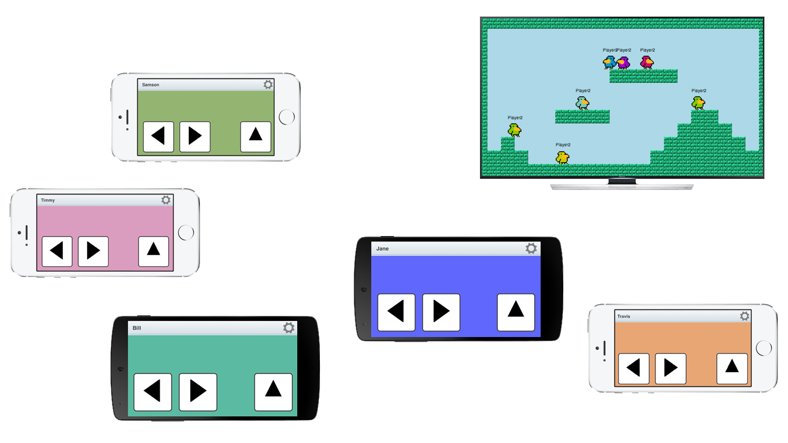
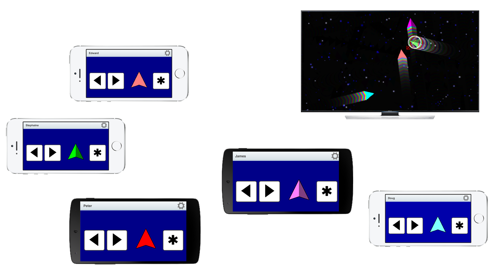
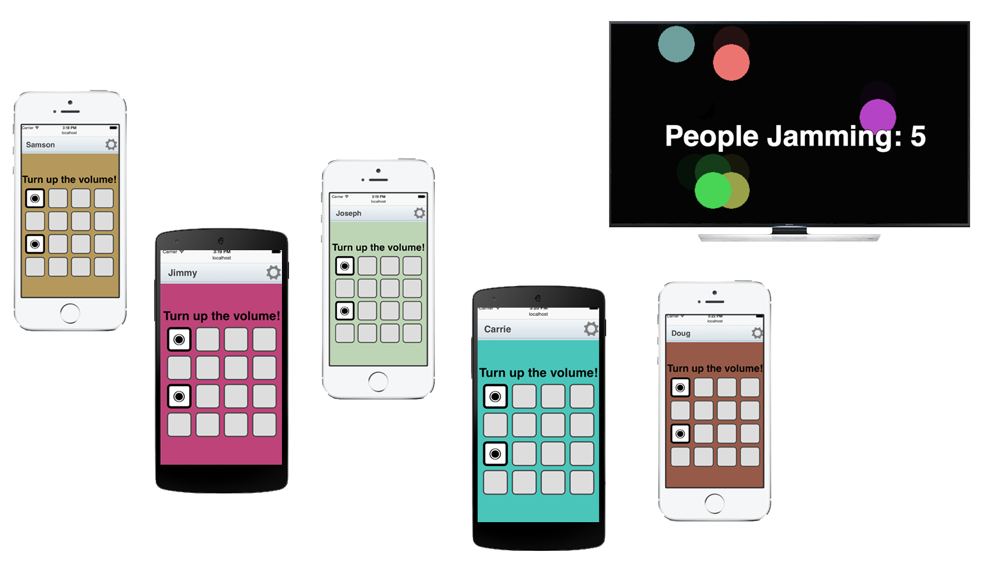
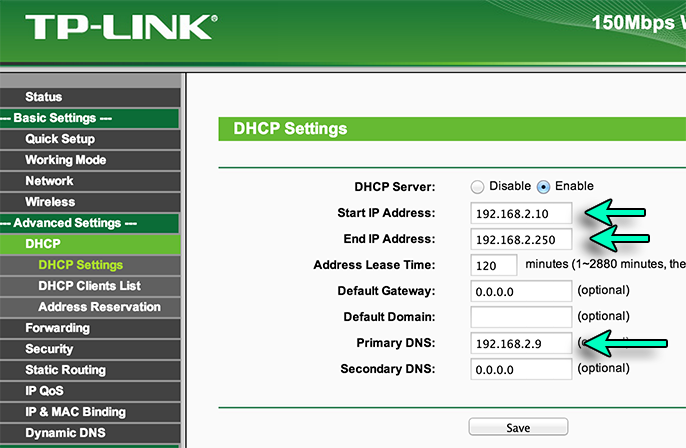

HappyFunTimes
=============

HappyFunTimes is a library for making party games that are meant to be
played with a bunch of people in the same room and 1 ideally large display.

People participate in the game using their smartphone by going to a webpage
provided by the game. The webpage lets them use their phone as a controller.
This lets you make games that support more than the typical 4 players.

It also lets you make games with unique controllers.

*   The smartphones end up just being smart controllers.

    As there is just one machine running the *real* game this means
    they are relatively easy to create. No crazy networking, state syncing,
    or dead reckoning required.

*   JavaScript libraries for the browser and Unity3D libraries are provided

    This makes it easy to bang out a game

*   For controllers the sky is the limit.

    Ideas

    *   Have a one button game. The user touches their screen.

    *   Make virtual DPads

    *   Make virutal paddle controllers (think Pong)

    *   Have users choose answers to question like Jeopardy

    *   Access the camera, send selfies to the game.

    *   Acesss the mic. Have each person use sounds to control something

    *   Use the device orientation API and rotate something in game to match

    *   Make a rhythm band where each device becomes an instrument.

    *   Make a rhythm game like Parappa but each person is a different color
        so that they each have to play their part at the right time

*   The API is simple to use.

    Basically there are 2 libraries and a webserver.

    `gameserver.js` provides a library that runs in the game that tracks players joining or
    leaving the game. It lets the game receive input from those players and
    send messages to them. (There's a Unity version of this library)

    `gameclient.js` provides a library that lets smartphones (browsers) connect to the game and
    send and receive messages. (There is NO Unity version of this library as the whole
    point is anyone with a smartphone should be able to play immediately, no need to
    install anything).

    `server.js` is a node.js based webserver. At a basic level all it does is relay
    messages to and from the smartphones and the game.

    Once connected, anytime a player (smartphone) connects to the game the game
    will get a `playerconnect` event and passed a NetPlayer object. After that
    any message the player's smartphone sends generates a corresponding event
    in the game on that NetPlayer. Conversely, any message the game sends to a
    NetPlayer object generates a corresponding event on the smartphone that corresponds to
    that NetPlayer.

    You can think of it this way. In the game (the code displaying the game on a large screen)

    When a player connects `gameserver` will generate an event. `playerconnected`. So

        gameServer.addEventListener('playerconnect', someFunctionToMakeANewPlayer);

        var someFunctionToMakeAPlayer = function(netplayer) {
          // Generate a new player and remember netplayer.
          ...
        };

    The users's webpage (smartphone) can send any command it wants by calling `gameClient.sendCmd`. Example

        gameClient.sendMsg('move', { x: 10, y: 20 });

    Back in the game, the corresponding `netplayer` will get an event.

        var someFunctionToHandleMove = function(data) {
           console.log("You got a move event: " + data.x + "," + data.y);
        };

        netPlayer.addEventListener('move', someFunctionToHandleMove);

    Conversely you can send messages back to the user's display by sending commands on the `netplayer`

        netPlayer.sendCmd('scored', { points: 200 });

    That player's `gameclient` will get that event

        var someFunctionToHandleScoring = function(data) {
           console.log("You scored " + data.points + " points!");
        };

        gameclient.addEventHandler('scored', someFunctionToHandleScoring);

    A simple client might look like this

        <h1 id="status">status</h1>
        

        
        
        

    A simple game would be something like this

        
        <h1 id="status"></h1>
        

        
        

*   There is also a synchronized clock across machines.

    Use it as follows.

        var online = true;
        var clock = SyncedClock.createClock(online);

        ...

        var timeInSeconds = clock.getTime();

    If online is false when the clock is created it will create a clock
    that returns the local time.

Unity Version
-------------

See [Unity Docs](unitydocs.md)

Running the Examples
--------------------

*   Clone the repo
*   Install [node.js](http://nodejs.org). I was using 0.10.26
*   Open a shell/terminal/command prompt
*   cd into the root of the repo you cloned (eg. `cd HappyFunTimes`)
*   type `npm install` which will install needed node modules locally
*   type `node server/server.js` which will start the server.

Open a browser window and go to `http://localhost:8080/examples/<nameofgame>/gameview.html`
In other window (preferably a window, not a tab), go to `http://localhost:8080` and
choose the game.

If you have other computers or smartphones on the same network look up the ip address of
the machine running the game (see `ifconfig` on OSX/Linux, the Network Preferneces on OSX,
or `ipconfig` on Windows) then go to `http://ipaddress:8080` from those machines.
For example on my home network it was `http://192.168.1.12:8080`

You can simulate other machines joining the game but opening more windows
or tabs in your browser.

Note: There is no reason the machine running the relayserver needs to be the same as the
machine running the game. Also, if the machine is accessable from the internet
you don't need to be on the same network. Of course there will be far more lag over
the internet or especially over cellular networks but depending on the type of game that
might be ok.

Windows docs
------------

[Some Windows docs here](windows.md)

Example Notes and tips
----------------------

Here's [a few notes on the provided examples](examples.md) as well as [a few tips](tips.md)
that have come up while making the examples.

Making It Simple For Players To Get Started
-------------------------------------------

Asking players to connect to a local network and then type in some obscure URL like
`http://169.234.174.30:8080` is arguably too many steps.

One solution. Use a QR code. Unfortunately iOS doesn't have a built in reader.

Another solution. Use a URL shortener. Not sure if `http://goo.gl/D3BfG4` is better or
worse than `http://169.234.174.30:8080`

The best solution is probably to setup a network router that redirects all traffic
to the relaysever. That way users can connect to your router and going to any webpage
will take them to the game. **This turns out it's not that hard**

We're going to tell the router to give the relayserver a specfiic IP address.
The relayserver has an option to handle DNS so we're going to setup a router
so it tells all devices connecting to it to ask the relayserver for DNS info.

Setup
-----

First, get a router. You probably have an old one or if you want to be portable I
recommend the [TP-Link TL-WR702N](http://google.com/#q=TP-Link+TL-WR702N).

Go to your router's admin page and find the DHCP settings. Somewhere there
should be a place that lets you assign a specfiic IP address to a specific MAC
address. On TL-WR702N that's under Advanced Settings->DHCP->Address Reservations

I looked up the MAC address for my machine (the relayserver) and assigned it
directly to `192.168.2.9`.

I then went to the main DHCP settings at Advanced Settings->DHCP->DHCP Settings and
configured it to give out IP addresses from to `192.168.2.10` to `192.168.2.250`.
Finally I set the DNS there to the same address I used for the relayserver
(`192.168.2.9`)

With that done I picked a nice name for my WiFi's SSID under
Basic Settings->Wireless->Wireless Settings

and in my case I decided to turn off security so no password is needed.

I'm not sure that's the best idea since lots of people's devices are set to automatically
connect to open routers.

With that done, reboot the router, connect your machine, then open a command prompt
and type

    sudo node server/server.js --port 80 --dns

You need `sudo` because port 80 is normally restricted.

Go to `http://localhost/games.html` and pick a game.

Now try connecting a smartphone to your router. If it's an iOS device it *should*
automatcally come up with a page that says "Start". If it's an Android device
open the browser and go to 'hft.com'

This should also work on Windows but you might need to create a prompt with admin
access? I don't have a Windows box at the moment to check.

Folder structure
----------------

    +-server   // code for node based relayserver
    |
    +-public   // the folder served by the relayserver
    | |
    | +-scripts  // The HappyFunTime JavaScript Library
    | |
    | +-examples  // the examples
    |   |
    |   +-scripts  // libraries shared by the examples, not part of HappyFunTimes
    |   |
    |   +-<example> // each example
    |     |
    |     +-scripts  // scripts specific to this example
    |     |
    |     +-assets   // assets for the specific example
    |
    +-Unity3D  // Unity3D lib
      |
      +-Examples  // Unity3D examples
      |
      +-Extras    // Other files the examples need but that aren't part of HappyFunTimes
      |
      +-src       // The HappyFunTimes library for Unity3D

Notes
-----

*   How secure is this?

    Not at all. This is not a library for the internet. It's a library for
    running a game at a party, meeting, bar, etc...

    That said if there's anything easy and performant you'd like to suggest
    submit a pull request.

*   What about cheating?

    Again, this is meant for games where everyone is in the same room watching
    the same display. If someone is off in the corner trying to hack the game
    through the net maybe you shouldn't have invited them to your party.

    That said if there's anything easy and performant you'd like to suggest
    submit a pull request.

*   Does it work on Windows and Linux?

    The clients of course run in any modern browser. The game also runs in
    whatever environment you've created them for. Most of the samples here
    are HTML and so should run in any modern browser on any platform.

    As for the relayserver I've only run it on OSX, Linux and Windows with
    no problems.

*   Why not WebRTC?

    WebRTC would possibly allow the phones to talk directly the game rather than through
    the relayserver. The relayserver would need to setup a rendevous between the 2 machines
    but after that the conncetion should be peer to peer.... Or so I'm lead to believe.

    Feel free to submit a pull request ;-)

To Do
-----

[There's lots of ideas](todo.md).
