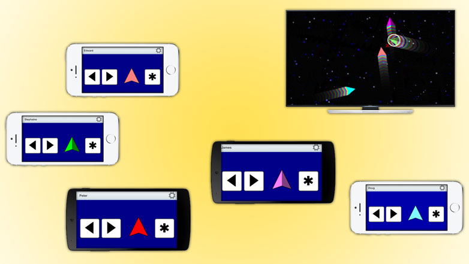
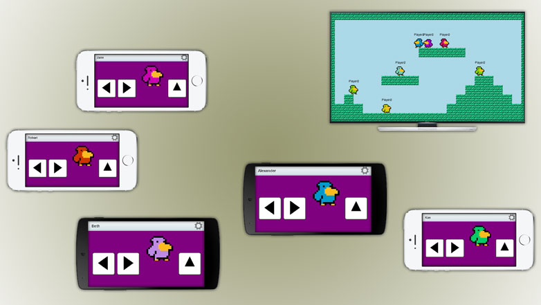
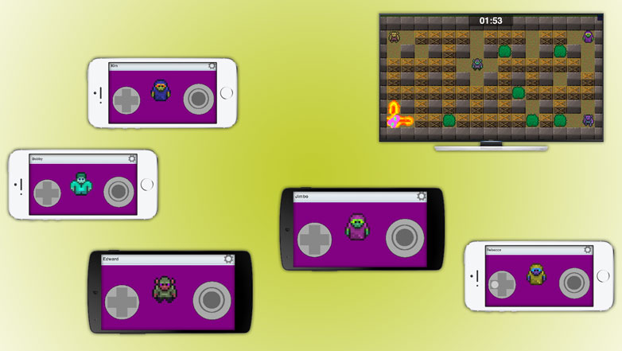

Title: Examples
Description: Various HappyFunTimes Examples

**Disclaimer:** These samples are only meant to show you how to use HappyFunTimes. Specifically
for controllers the class `GameClient`. For games the classes `GameServer` and `NetPlayer`.
Everything else is just game jam quality example code. If you're going to make a real game
please consider using an existing game framework or writing your own. If these examples fit
your needs then by all means feel free to use, clone, or modify them. My only point is they
are not neccessily showing best practices for games in JavaScript.

Some terms
----------

**controller** = The code running on the player's smartphone browser (or desktop/tablet browser).

**game** = The code running the game on the on PC connected to some large display everyone can see.

**relayserver** = A node based server that passes messages to and from contollers to games.

**GameClient** = An object running in the **controller** that lets the controller send and
receive messages with the **game**.

**GameServer** = An object running in the **game** that lets the game receive new players.

**NetPlayer** = An object created by the **GameServer** anytime a new **controller** joins the game.
It is passed to the game in a `playerconnected` event. It is used to send and receive messages from
an individual **controller**.

Here are a few random notes on the examples.

Player Names
------------

Many of the samples support a user name. This feature is not technically part of the
**HappyFunTimes** library but is rather just part of the samples using the library.
The name is stored in a local cookie .
When a **controller** starts it looks for the cookie and then sends the name to the game.
If the game receives "" as the name it sends name back to the player. The message
sent is `setName` in both directions, controller to game, game to controller.

The **controller** also sends a `busy` message with `true` when the user starts editing the name
and `false` when they finish.

On the **controller** side this is mostly handled by shared code `PlayerNameManager` (playername.js).
On the **game** this is handled by each game directly.

[Simple](http://github.com/greggman/hft-simple)
------

Basically the same as SuperSimple except uses normalized cooridinates and uses a canvas element to draw
the game rather than HTML5 elements.

[PowPow](http://github.com/greggman/hft-powpow)
------

A space wars style game. The first 6 players battle it out. If there are more than 6 players they wait
in the *launch* queue. They collectively control a ghost ship they can use to try to kill other players
so they can get back into the game.

[JumpJump]((http://github.com/greggman/hft-jumpjump)
--------

A simple platformer. Players try to get the one coin.

[Boomboom]((http://github.com/greggman/hft-boomboom)
--------

A bomberman like game. One thing it shows over other games is round based control. Players
joining the game have to wait for the current round to finish before they are added.

[Deviceorientation](http://github.com/greggman/hft-deviceorientation)
-----------------

Orient a 3d ship to shoot a ball.

Demonstrates using device orientation. The game is nearly impossible to play but it least
demonstrates using device orientation as well as three.js.

[Simple-no-electron](http://github.com/greggman/hft-simple-no-electron)
------

Same as simple above but without electron.

## Unity

For Unity examples download [the HappyFunTimes plugin](https://www.assetstore.unity3d.com/en/#!/content/19668).

