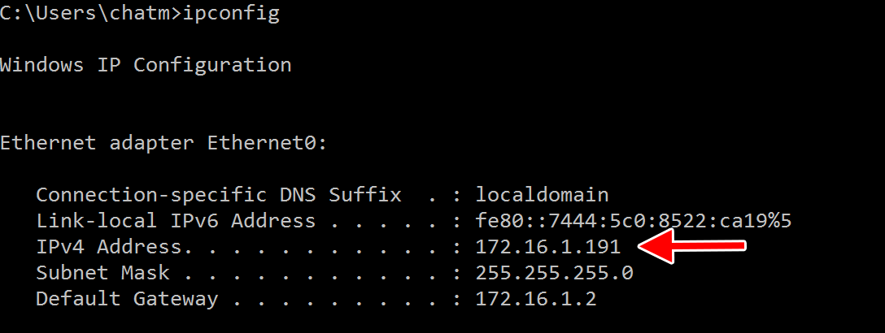
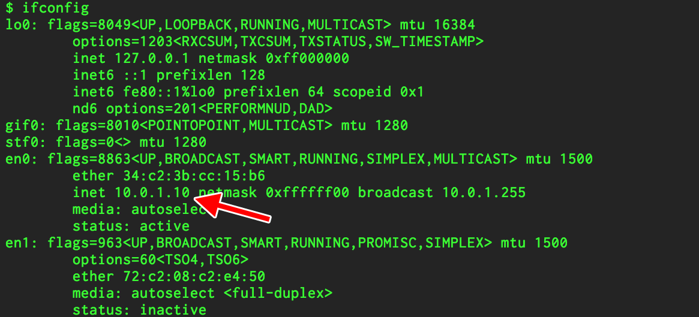
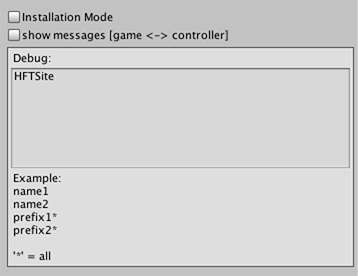
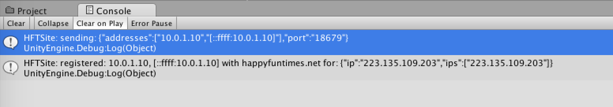

Title: Troubleshooting
Description: Troubleshooting HappyFunTimes

## Common Issues

### Phones can't connect

*   Are they on the same WiFi / same router as the game?

    HappyFunTimes requires the phones to be able to talk directly
    to the system running the game so the first thing to do is
    check the phones are on the same WiFi

    Additionally Corporate WiFi and Internet Cafe WiFi is often
    configured so that phone can not connect to computers.
    HappyFunTimes, in general, only supports home routers.

*   Does the game have pemission to access the internet?

    On Windows in particular, the first time a game (or Unity) is run
    Windows will pop up a window asking to give the game permission
    to access the internet or not. If you said *no* or if the system
    is configured to automically deny access then you need to go into
    your Windows Firefall settings and grant access

    [This article might be helpful](https://www.technipages.com/blockunblock-programs-in-windows-firewall)

## How HappyFunTimes Works

HappyFunTimes works by running a small web server. The web server serves the webpages to the phones.
It also implements websockets which allow the phone and the game to pass messages between each other.

Look up the IP address of your computer

On Windows

*   Open a command prompt and type `ipconfig`

    

On macOS/Linux

*   Open a terminal and type `ifconfig`

    

If you run your game you should be able to connect the phone to the game going directly to
that address.

On your phone open your browser and type `http://<ipaddress>:18679` where `<ipaddress>` is
the address of the computer running the game. For example looking at the windows machine
above its ip address is `171.16.1.191` so you'd type `http://171.16.1.191:18679` into your
phone.

If the phone does NOT connect to game one of 3 things are wrong

1.  Your phone is not actually on the same network

    Double check.

2.  If you are using Unity then one possiblity is the path to the controller in the happyfuntimes options
    is not set correctly

    See [Unity3D HappyFunTimes Options](unity/happyfuntimes-options.html#Controller-Filename)

3.  Your router is not allowing devices to talk to each other.

    Generally home internet routers let all devices connected to them to talk to each other.
    On the other hand corporate networks, university and school networks, and internet cafe networks
    often do **not** let devices on the same network talk to each other.

    You'll need to figure out how to allow those devies to talk to each other.

    One way to test is to use a `ping` program.

    For iOS you can use [a program like this](https://itunes.apple.com/us/app/ping-network-reachability-test/id576773404?mt=8)
    or for Android [a program like this](https://play.google.com/store/apps/details?id=ua.com.streamsoft.pingtools&hl=en).

    Download the app, make sure the phone is connected to the same network as your computer. Look up the computer's
    ip address. Then, using the app, try to *ping* the computer.

    If you can not ping the computer from your phone then your router either needs to be reconfigured OR
    you need to get another router for your happyfuntimes project (they cost as little as $15).

## `happyfuntimes.net`

When using happyfuntimes you normally tell users to go to `happyfuntimes.net`. happyfuntimes.net sole
purpose is to type `http://<ipaddress>:18679` for your users since telling users to type something like
***aitch tee tee pee colon slash slash one nine two dot one six eight dot two dot seven nine colon one
eight six seven nine*** is way harder then just telling them to type ***happy fun times dot net***.

happyfuntimes.net works because on a normal home router all devices (your phones, your computer, etc)
look like they are the same to machines on the internet.

So, when a happyfuntimes game starts it sends a message to `happyfuntimes.net` saying "hey! I started a game.
My local ip address is <ipaddress>". That `<ipaddress>` is the *local* ip address. The one we looked up above.
It's only a useful address for computers using the same router to talk to each other.

happyfuntimes.net sees the message. It also sees your router's public IP address. Your router's public IP
address is the address computers on the internet use to talk to your router and hence the machines
connected to your router. Let's pretend your router's public ip address is `12.34.56.78`.
happyfuntimes.net then records that there is a game running at local ip address `171.16.1.191`
on a machine at public ip address `12.34.56.78`.

Now a user who's phone is connected to the same router goes to happyfuntimes.net. Happyfuntimes.net sees
that this phone is also from the same router's public ip address. In this case `12.34.56.78`. So it sees there is
a game associated with that public ip address of `12.34.56.78` and so it tells the phone `go to http://171.16.1.191:18679`.

Once that is done happyfuntimes.net is out of the loop. The phone is now talking directy to the game and the
game to the phone just as if you had typed `http://171.16.1.191:18679` directly into the phone's browser.

### Troubleshooting happyfuntimes.net

Reading the section above there are things that can go wrong. If the router gives the computer and the phone
different public IP addresses then happyfuntimes.net will not find any maching ip address to direct the phone
to connect to.

You can see what happyfuntimes.net thinks your public IP address is by typing this into your browser

    http://happyfuntimes.net?verbose=true&go=false

Do this on **both** your computer *and* your phone. You will get a list of numbers on the screen. Example

    checking: http://happyfuntimes.net/api/getgames2
    hft response: {"gameIps":[],"publicIps":["12.34.56.78"]}

One of the public IP addresses (there may be more than one) on the phone and the computer must match.
If they do not match then happyfuntimes can not tell your computer and your phone are on the same network.
Either the are actually *not* on the same network, verify that they are. Or, your router is reporting different
ip addresses for different devices in which case you'll need to configure your router or use
a different one or tell your users to type the entire local ip address into their phones.

### IPv6

IPv6 uses different and longer numbers. If you are on an IPv6 network then if you go to the web pages above
you might see something like this

*   On the computer

        checking: http://happyfuntimes.net/api/getgames2
        hft response: {"gameIps":[],"publicIps":["2601:204:c702:5f87:3d3e:d184:f486:1e8a"]}

*   On the phone:

        checking: http://happyfuntimes.net/api/getgames2
        hft response: {"gameIps":[],"publicIps":["2601:204:c702:5f87:c541:9c94:3c2c:7d45"]}

For IPv6 what's generally important is that the first 12-24 numbers match. The last few should
not matter. You'll notice above the phone's and the computer's first 15 numbers match (`2601:204:c702:5f87`).

To check that your phone can connect using IPv6 you can try your computer's public IPv6 address by
typing for example (using the number above).

     http://[2601:204:c702:5f87:3d3e:d184:f486:1e8a]:18679

If that does not work you can try typing your computer's local IPv6 address. With IPv6 isn't
not common to have a local address. Local addresses start with `FC00`. Use the examples above
for `ipconfig` (windows) or `ifconfig` (macos/linux). Find you have a local IPv6 address and type that in
in the format `http://[IPv6address]:18679`

You can also try the ping IPv6 addresses with the tools mentioned above.

### Debugging further

If you run your game and then go to the webpages mentioned above the `gameIps:[]` section
should list the local addresses happyfuntimes returns for games that match the public ip address.

#### Unity

If you're using Unity you can enable debugging, in this case from the menus pick
`Window->HappyFunTimes->HappyFunTimes Settings`.

In the debug area type `HFTSite`

  

Now run the game. You should see a message like this in the console.

  

The first message shows what the happyfuntimes unity plugin reported to happyfuntimes.net.
These are the local IP addresses.

The second message shows what those local ipaddress and what public ipaddress were associated
with them.

#### Electron / hft command line

You should be able to tell happyfuntimes which local IP address to send by using `--address=ipaddress`.
By default happyfuntimes uses all local ip addresses. It's not common to have more than one but
if you have complex networking or run VMs you might have more than one.

