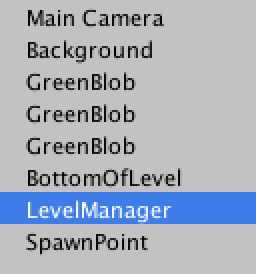
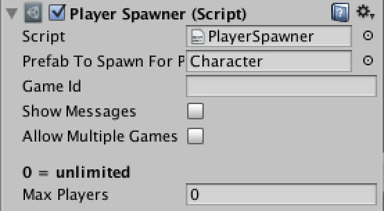
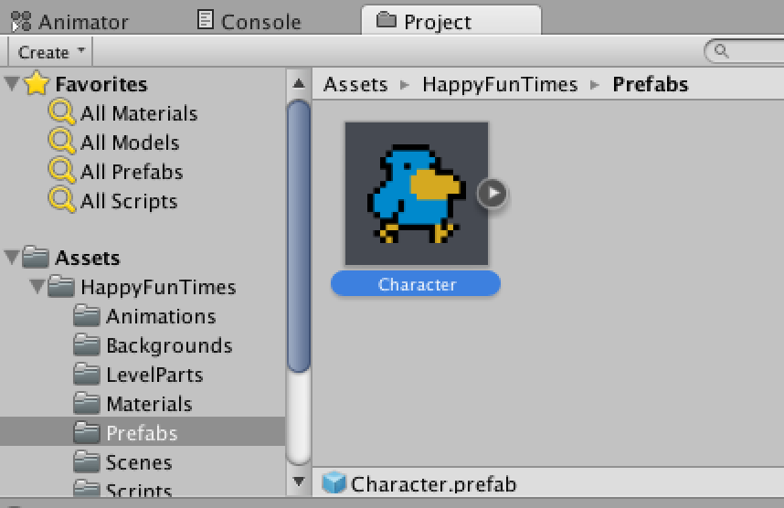
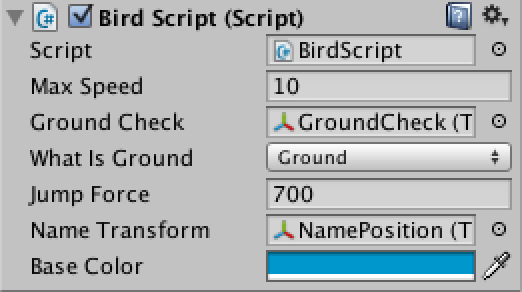
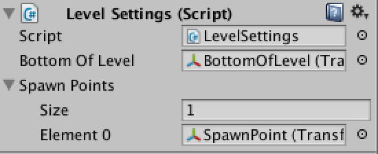

Title: 2d Platformer
Description: Using HappyFunTimes with a 2d platformer

This is just one example. There is no "correct" way. There's whatever
works for your game. Maybe you'd like to make it so players
tilt their phone left or right to move their character and
shake it to jump. It's really up to you.

You can [download this sample here](http://docs.happyfuntimes.net/docs/unity/samples.html?owner=greggman&repo=hft-unity2dplatformer).

Note: You should consider checking out the [HappyFunTimes Unity GamePad example](gamepad.md)
which is easier than this sample. This sample is still 100% valid and serves as a good example
of doing everything with custom code.

## A short explaination:

This sample is based on [one of the Unity tutorials](https://unity3d.com/learn/tutorials/modules/beginner/2d).
If you haven't already I suggest you go through those tutorials as they will help you
get familar with Unity and the code. Then the stuff below will just cover some
of the things that needed to change.

The first thing we need to do is design a controller to run on the phone.

### HTML

First the HTML in `Assets/WebPlayerTemplates/HappyFunTimes/controller.html`

    

      

      

      <canvas id="avatar"></canvas>
      

    

Above we can see there's a `buttons` area. It will be made fullsize. Inside it are 4
parts. A left, right, and up butotn. and a canvas where we can draw our avatar.

There's also this part which will show if the phone is in portrait mode.

    <!-- hft-portrait only shown if he phone is in portrait mode -->
    

      

        

          Turn the Screen
        

        

          &#x21ba;
        

      

    

It basically tells users to turn their phone on the side. Hopefully as HTML5
progresses we'll be able to get rid of this need.

### CSS

The corresponding CSS from `Assets/WebPlayerTemplates/HappyFunTimes/css/controller.css`

    #buttons {
        position: absolute;

        /* make sure the user dragging their fingers or the mouse point
           doesn't select anything */
        -moz-user-select: none;
        -webkit-user-select: none;
        -o-user-select: none;
        user-select: none;
    }

Next we define buttons, their size, that they are absolutely positioned
and then set their positions

    .button {
        width: 110px;
        height: 110px;
        text-align: center;
        font-size: 70px;
        font-family: Helvetica, Arial, sans-serif;
        font-weight: bold;
        bottom: 60px;
        position: absolute;
    }
    #left {
      left: 20px;
    }
    #right {
      left: 140px;
    }
    #up {
      right: 20px;
    }

and we do the same for the avatar canvas

    #avatar {
      position: absolute;
      left: 50%;
      bottom: 130px;
      width: 128px;
      height: 128px;
    }

This code moves the buttons and the avatar canvas if the screen is really small

    @media only screen and (max-height : 208px) {
        .button {
            bottom: 22px;
        }
        #avatar {
          left: 56%;
          width: 64px;
          height: 64px;
          bottom: 52px;
        }
    }

### JavaScript

And the JavaScript from `Assets/WebPlayerTemplates/HappyFunTimes/scripts/controller.js`

This part says which libraries to include. The first part is the path to each
library. The second part is a list of variables to assign the libraries to.
The ones that start with `hft/` are part of HappyFunTimes and are
[documented here](/docs/hft/). The rest are part of this sample.

    // Start the main app logic.
    requirejs(
      [ 'hft/commonui',
        'hft/gameclient',
        'hft/misc/input',
        'hft/misc/misc',
        'hft/misc/mobilehacks',
        'hft/misc/touch',
        '../3rdparty/hft-utils/dist/audio',
        '../3rdparty/hft-utils/dist/imageloader',
        '../3rdparty/hft-utils/dist/imageutils',
      ], function(
        CommonUI,
        GameClient,
        Input,
        Misc,
        MobileHacks,
        Touch,
        AudioManager,
        ImageLoader,
        ImageUtils) {

We have some code to send a message to Unity for when the place presses left or right.

    var g_leftRight = 0;
    var g_oldLeftRight = 0;

    function handleLeftRight(pressed, bit) {
      // Clear the bit for this direction and then set it if pressed is true.
      g_leftRight = (g_leftRight & ~bit) | (pressed ? bit : 0);
      // Only send if anything has changed.
      if (g_leftRight != g_oldLeftRight) {
        g_oldLeftRight = g_leftRight;

        // send a direction (-1, 0, or 1)
        g_client.sendCmd('move', {
            dir: (g_leftRight & 1) ? -1 : ((g_leftRight & 2) ? 1 : 0),
        });
      }
    };

Similarly we have a function for jumpping

    var g_jump = false;

    function handleJump(pressed) {
      // Only send it if it has changed
      if (g_jump != pressed) {
        g_jump = pressed;
        g_client.sendCmd('jump', {
            jump: pressed,
        });
      }
    };

We then connect those functions to keys for when testing in a desktop browser

    var keys = { };
    keys[Input.cursorKeys.kLeft]  = function(e) { handleLeftRight(e.pressed, 0x1); }
    keys[Input.cursorKeys.kRight] = function(e) { handleLeftRight(e.pressed, 0x2); }
    keys["Z".charCodeAt(0)]       = function(e) { handleJump(e.pressed);           }
    Input.setupKeys(keys);

And we connect them to the various HTML elements for our buttons

    Touch.setupButtons({
      inputElement: $("buttons"),   // element receiving the input
      buttons: [
        { element: $("left"),  callback: function(e) { handleLeftRight(e.pressed, 0x1); }, },
        { element: $("right"), callback: function(e) { handleLeftRight(e.pressed, 0x2); }, },
        { element: $("up"),    callback: function(e) { handleJump(e.pressed);           }, },
      ],
    });

Note that we use one element to receive all the input. `Touch.setupButtons` will look at
where each button element is and call the corresponding function.

We also have some code for drawing the avatar.

First off we load the avatar image and we don't actually start running the
controller until that image has loaded

    var images = {
      idle:  { url: "images/bird.png", },
    };

    ImageLoader.loadImages(images, startClient);

We setup a GameClient

    g_client = new GameClient();

And assign a function to call when we're told what color the player is

    g_client.addEventListener('setColor', handleSetColor);

That function looks like this

    function handleSetColor(msg) {
      // Look up the canvas for the avatar
      var canvas = $("avatar");

      // Get the size it's displayed by CSS and make
      // it's internal dimensions match.
      var width = canvas.clientWidth;
      var height = canvas.clientHeight;
      canvas.width = width;
      canvas.height = height;

      // Now get a context so we can draw on it.
      var ctx = canvas.getContext("2d");

      // Adjust the avatar's hue, saturuation, value to match whatever color
      // we chose.
      var coloredImage = ImageUtils.adjustHSV(images.idle.img, msg.h, msg.s, msg.v, msg.range);

      // Scale the image larger. We do this manually because the canvas API
      // will blur the image but we want a pixelated image so it looks "old skool"
      var frame = ImageUtils.scaleImage(coloredImage, 128, 128);

      // Draw it in the canvas and stretch it to fill the canvas.
      ctx.drawImage(frame, 0, 0, ctx.canvas.width, ctx.canvas.height);
    };

### Now on the game side, in Unity.

We're using the Character Controller example which was written in UnityScript.
It's in `Assets/HappyFunTimes/Scripts/Example3rdPersonController.js`

There isn't much too it. It's basically [the same code from the Unity tutorials](https://unity3d.com/learn/tutorials/modules/beginner/2d).
For HappyFunTimes we needed to add a few functions.

### LevelManager / PlayerSpawner

Select the `LevelManager` object from the scene.

Notice the `PlayerSpawer`. `PlayerSpawner` is a standard HappyFunTimes component. There should
only be one per scene. It spawns a prefab each time a player connects to HappyFunTimes with their phone.

You can see the spawns the prefab `Character`.

### Character

Select the `Character` prefab from `HappyFunTimes/prefabs/Character`

Looking inside the character you can see it uses the `BirdScript`

### BirdScript

`BirdScript.cs` is basically [the same code from the unity tutorial](https://unity3d.com/learn/tutorials/modules/beginner/2d)
with a few additions for HappyFunTimes

#### InitializeNewPlayer

This function is called anytime a new player is created by the `PlayerSpawner`.

    // Manages the connection between this object and the phone.
    private NetPlayer m_netPlayer;

    // Called when player connects with their phone
    void InitializeNetPlayer(SpawnInfo spawnInfo)
    {
        Init();

        m_netPlayer = spawnInfo.netPlayer;
        m_netPlayer.OnDisconnect += Remove;
        m_netPlayer.OnNameChange += ChangeName;

        // Setup events for the different messages.
        m_netPlayer.RegisterCmdHandler<MessageMove>("move", OnMove);
        m_netPlayer.RegisterCmdHandler<MessageJump>("jump", OnJump);

        MoveToRandomSpawnPoint();

        SetName(m_netPlayer.Name);

        // Pick a random amount to adjust the hue and saturation
        float hue = Random.value;
        float sat = (float)Random.Range(0, 3) * -0.25f;
        MessageSetColor color = new MessageSetColor(
            hue,
            sat,
            0.0f,
            m_material.GetFloat("_HSVRangeMin"),
            m_material.GetFloat("_HSVRangeMax"));
        SetColor(color);

        // Send it to the phone
        m_netPlayer.SendCmd("setColor", color);
    }

The code above is very straight forward. First `m_netPlayer` is set to the `NetPlayer` object
that represents the connection between the user's phone and Unity.

It then sets up several callbacks. Call `Remove` if the phone disconnects. Call `ChangeName` if
the user changes their name. Call `OnMove` if we receive the `"move"` command we created
above. Call `OnJump` if we receive a `"jump"` command we created above.

Then call `SetName` with the user's current name. Pick a random color, use it to set the
color of our character and the color of the name label and finally send what we picked
to the phone.

#### Messages received from the phone

We need to define classes to receive the data we defined above from the phone

    // Message when player presses or release jump button
    private class MessageJump
    {
        public bool jump = false;
    }

    // Message when player pressed left or right
    private class MessageMove
    {
        public int dir = 0;  // will be -1, 0, or +1
    }

We use those messages in `OnMove` and `OnJump` whic just set a few variables.

    void OnMove(MessageMove data)
    {
        m_direction = data.dir;
    }

    void OnJump(MessageJump data)
    {
        m_jumpJustPressed = data.jump && !m_jumpPressed;
        m_jumpPressed = data.jump;
    }

`m_direction` will be -1, 0, or 1 depending on if the user is pressing left, right or not at all.
`m_jumpPressed` will be true if the player is holding the jump button. `m_jumpJustPressed` will be
true if the player was previously not pressing the button but now is. It's cleared in `Update`.

We look at these in `Update` and `FixedUpdate` which are just modified versions from the
[tutorial](https://unity3d.com/learn/tutorials/modules/beginner/2d).

    void Update()
    {
        // If we're on the ground AND we pressed jump (or space)
        if (m_grounded && (m_jumpJustPressed || Input.GetKeyDown("space")))
        {
           ...

    void FixedUpdate () {
       ...

       // Get left/right input (get both phone and local input)
       float move = m_direction + Input.GetAxis("Horizontal");

Reading the keyboard using `Input.GetXXX` is just there to make it easy to test, debug, and interate.
We can start unity, open a local browser window and go to `http://localhost:18679`. Once we do that
we can switch back to unity and just press the arrow and space bar to test the game's physics and stuff.
If we stop unity and start it again that local browser will re-connect automatically so we can continue
to test just using the keyboard.

#### Messages sent to the phone

To send our color choice to the phone we define a class for that

    // Message to send to phone to tell it the color of the avatar
    // Note that it sends an hue, saturation, value **adjustment**
    // meaning that RGB values are first converted to HSV where H, S, and V
    // are each in the 0 to 1 range. Then this adjustment is added to those 3
    // values. Finally they are converted back to RGB.
    // The min/max values are a hue range. Anything outside that range will
    // not be adjusted.
    private class MessageSetColor
    {
        public MessageSetColor() { }  // for deserialization
        public MessageSetColor(float _h, float _s, float _v, float _min, float _max)
        {
            h = _h;
            s = _s;
            v = _v;
            rangeMin = _min;
            rangeMax = _max;

        }
        public float h; // hue
        public float s; // saturation
        public float v; // value
        public float rangeMin;
        public float rangeMax;
    }

#### Setting the color of the character in Unity

Setting the color used for the character is a little funky. We're using
[an HSVA shader that lets us selectively adjust the hue, saturation, and value of part
of an image based on a hue range](https://github.com/greggman/hsva-unity). We need to
know the base color of the character so we can then apply the adjustments to that
color to see what the final color becomes. That color is set manually in Unity.

    void SetColor(MessageSetColor colorAdjust) {
        // get the hsva for the baseColor
        Vector4 hsva = ColorUtils.ColorToHSVA(baseColor);

        // adjust that base color by the amount we picked
        hsva.x += colorAdjust.h;
        hsva.y += colorAdjust.s;
        hsva.w += colorAdjust.v;

        // now get the adjusted color.
        Color playerColor = ColorUtils.HSVAToColor(hsva);

        // Create a 1 pixel texture for the OnGUI code to draw the label
        Color[] pix = new Color[1];
        pix[0] = playerColor;
        Texture2D tex = new Texture2D(1, 1);
        tex.SetPixels(pix);
        tex.Apply();
        m_guiStyle.normal.background = tex;

        // Set the HSVA material of the character to the color adjustments.
        m_material.SetVector("_HSVAAdjust", new Vector4(colorAdjust.h, colorAdjust.s, colorAdjust.v, 0.0f));
        m_material.SetFloat("_HSVRangeMin", colorAdjust.rangeMin);
        m_material.SetFloat("_HSVRangeMax", colorAdjust.rangeMax);
    }

### LevelSettings.cs

The rest of the code in BirdScript should be clear to anyone that's use Unity much or
gone through [the 2d platformer tutorial](https://unity3d.com/learn/tutorials/modules/beginner/2d).
That example made an enclosed world. For me, instead, I just used a few locators. They are
attached to the `LevelSettings.cs` script which is attached to the `LevelManager` object.

If a player falls below the `bottomOfLevel` locator then I just respawn them. For respawn points
there is an array of `spawnPoints`. I only made one in this sample.

The code for `LevelSettings.js` adds a `static` accessor, `settings`. This means any other script
can access the global settings using `LevelSettings.settings.<nameOfSetting>`.

For example in `BirdScript.cs` we pick a random spawn point like this

    void MoveToRandomSpawnPoint()
    {
        // Pick a random spawn point
        int ndx = Random.Range(0, LevelSettings.settings.spawnPoints.Length - 1);
        transform.localPosition = LevelSettings.settings.spawnPoints[ndx].localPosition;
    }

And in `FixedUpdate` we check for the players falling below the bottom of the level like this

    if (transform.position.y < LevelSettings.settings.bottomOfLevel.position.y) {
        MoveToRandomSpawnPoint();
    }

