Title: 3d Characters
Description: How to control 3D characters with HappyFunTimes

I wanted to include a 3D game but I don't own any 3D assets
and it seemed improper to include Unity's Standard Assets
so, here are the instructions to create a 3D example
from scratch. I'm only guessing it will take around 20-30 minutes
(5 minutes if you've already done it once).

It will hopefully also be a good tutorial on how to take
something that's already designed to work with controllers
and make it work with HappyFunTimes

Follow these steps

* Make a new project

  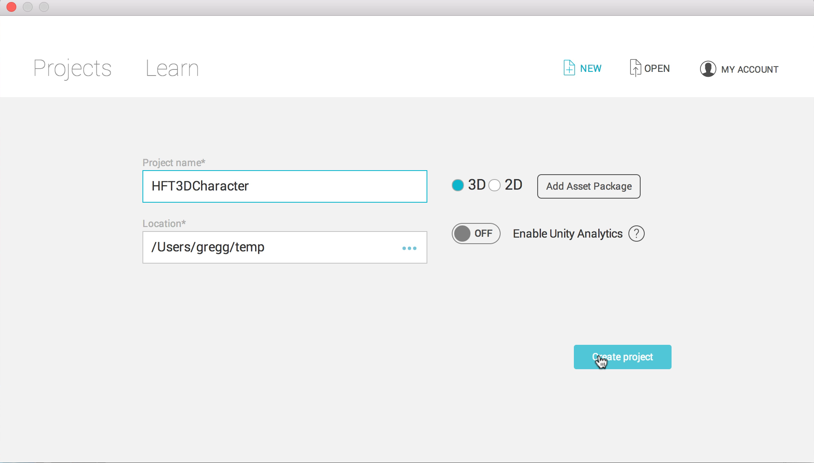

* Open the asset store

  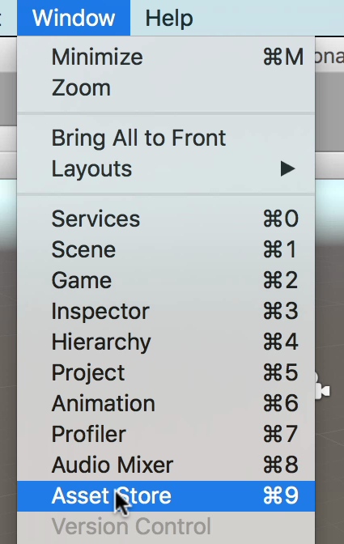

* Download HappyFunTimes

  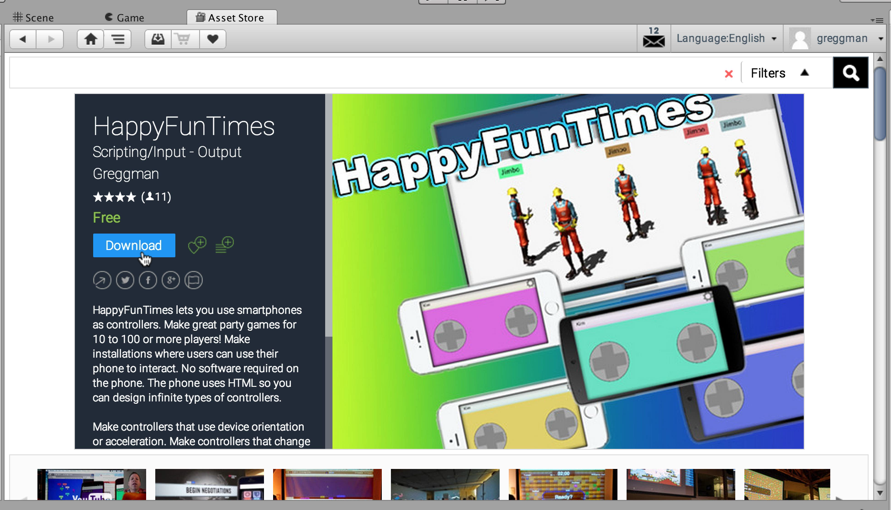

* Import the standard character assets

  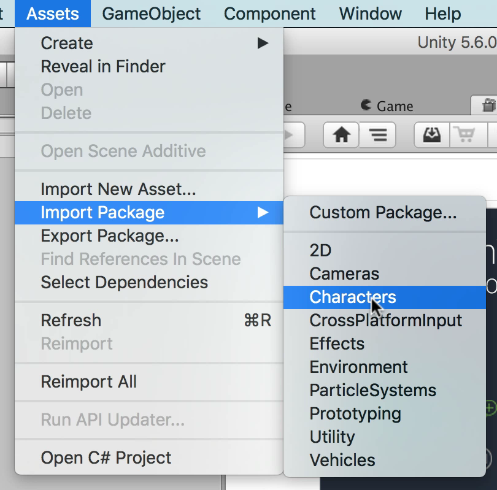

* Create an empty GameObject for a level manager

  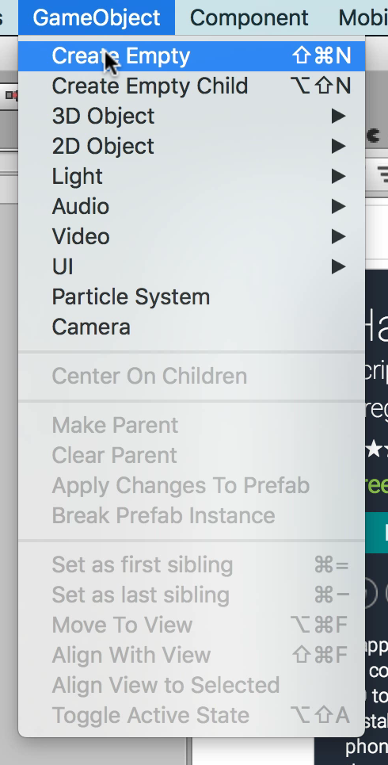

* Rename it "LevelManager" and add a player spawner, then click the little circle
  on the far right of `prefab to spawn for player`

  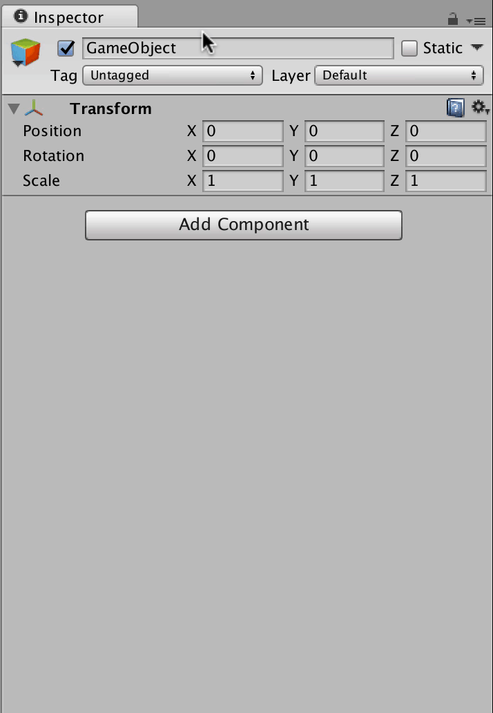

* Select the "ThirdPersonContoller" prefab (setting the `prefab to spawn for player`)

  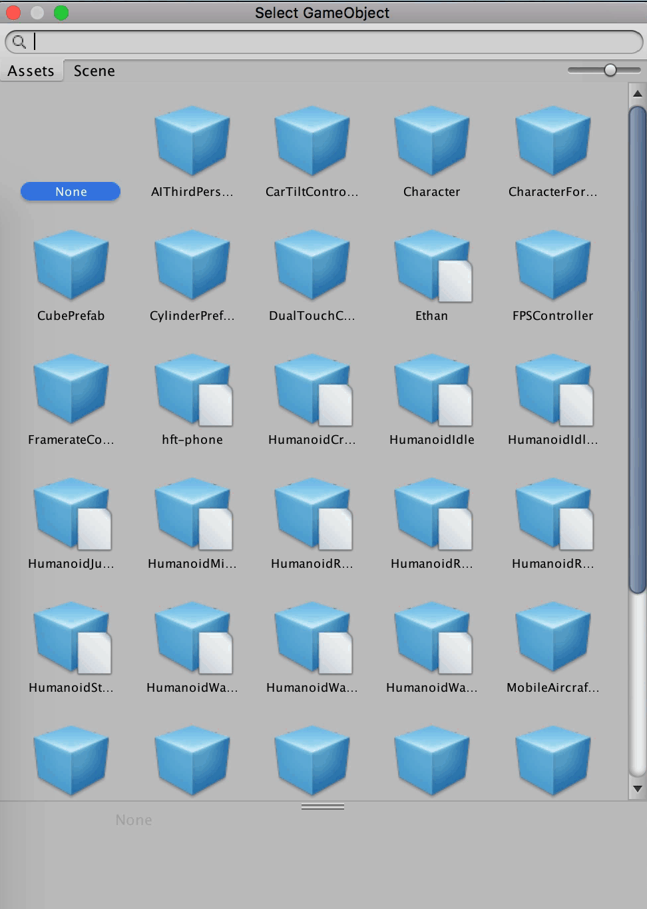

* Select the prefab in the hierarchy, It's in `Assets/Standard Assets/Characters/ThirdPersonCharacter/Prefabs`.

  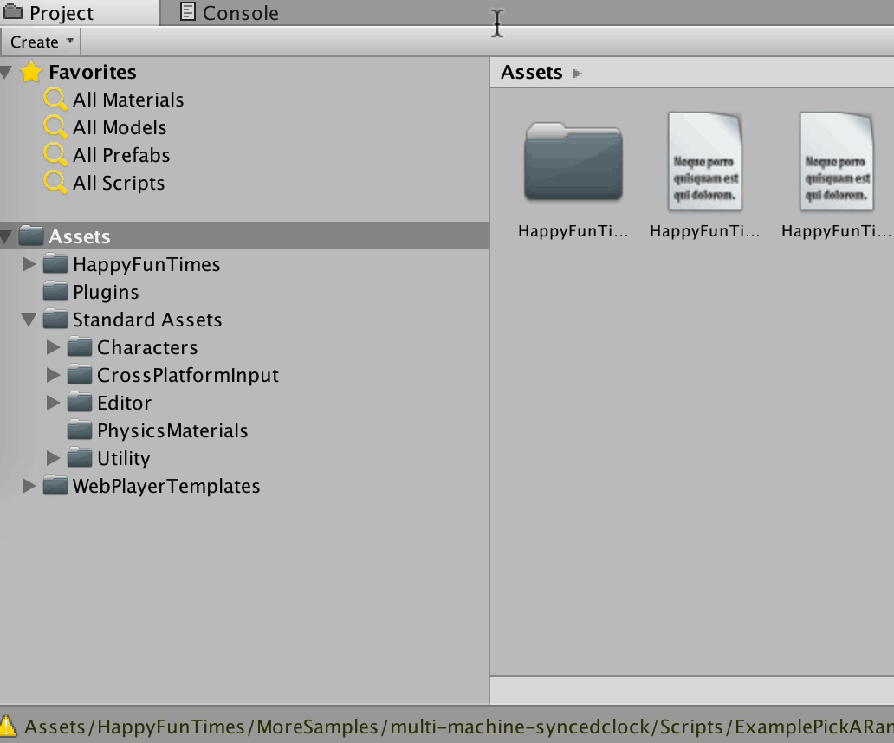

* Add an `HFTInput` script to the prefab.

  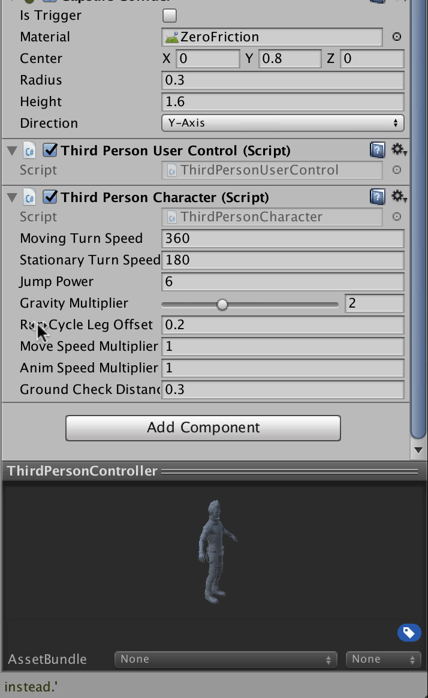

* Select the `ThirdPersonUserControl` script in `Assets/Standard Assets/Characters/ThirdPersonCharacter/Scripts`.

  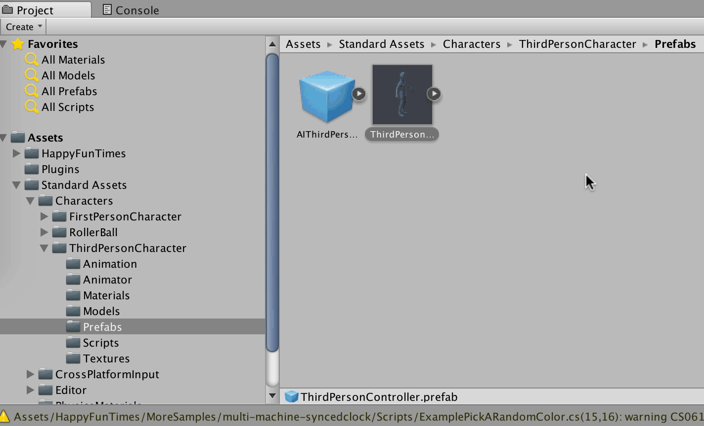

* Duplicate it (Cmd-D / Ctrl-D or Edit->Duplicate from the menus), Rename it `ThirdPersonUserControlHFT`,
  and move it to the `Asset` folder (or somewhere outside of Standard Assets)

  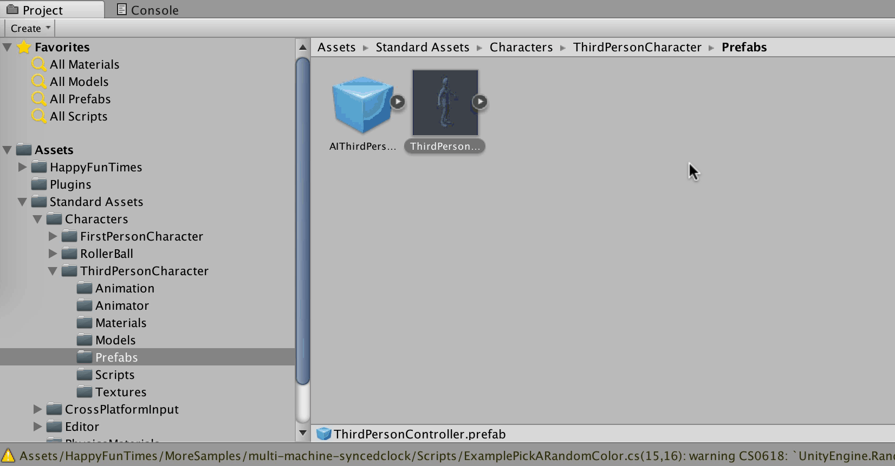

* Edit the script (see [the gamepad docs](gamepad.html))

  The steps are

     1.  rename it `ThirdPersonUserControllerHFT`
     2.  add a `private HFTInput m_hftInput;` and `private HFTGamepad m_gamepad;`
     3.  In `Start` set `m_hftInput = GetComponent<HFTInput>();` and `m_gamepad = GetComponent<HTFGamepad>();`.
     4.  Add `m_gamepad.OnDisconnect += Remove`;
     5.  Add a `Remove` method that calls `Destroy`.
     6.  In `Update` check for `m_hftInput.GetButtonDown("fire1");`
     7.  In `FixedUpdate` add in `+ m_hftInput.GetAxis("Horizontal")` and
         `- m_hftInput.GetAxis("Vertical")`
     8.  Also add `m_hftInput.GetButton("fire2")` to the crouch check

  

  <a href="assets/3d-step1-diff.html" target="_blank">Here's a diff of the changes (click here for a new tab)</a>.

  <iframe src="assets/3d-step1-diff.html" width="900" height="500"></iframe>

* Select the prefab again

  

* Delete the `ThirdPersonUserControl` script on the prefab, and
  add the `ThirdPersonUserControlHFT` script on the prefab

  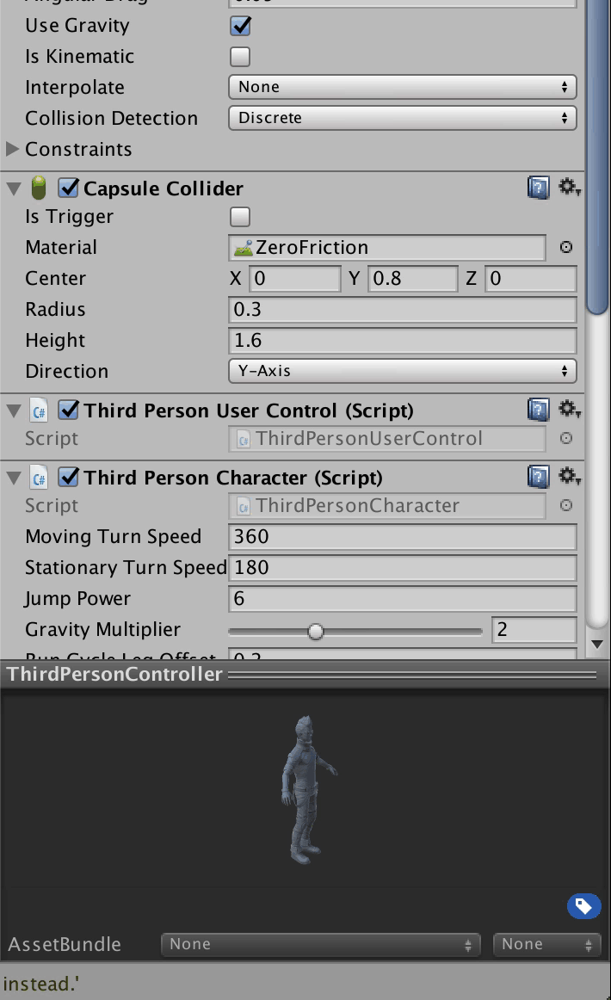

* Create a Plane GameObject

  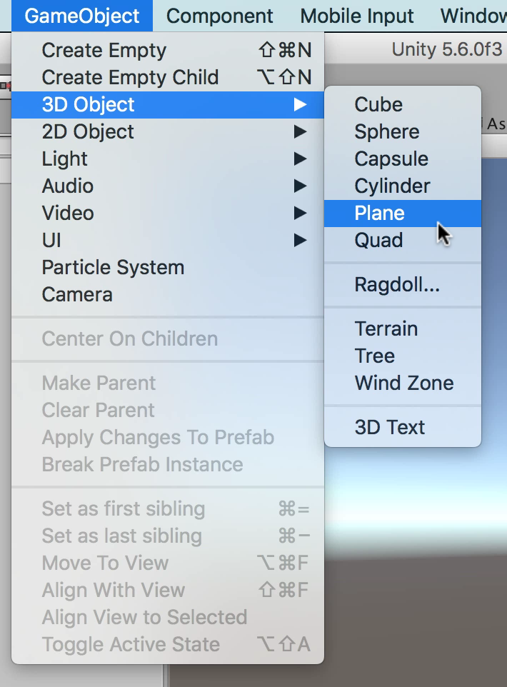

* Add a Box Collider

  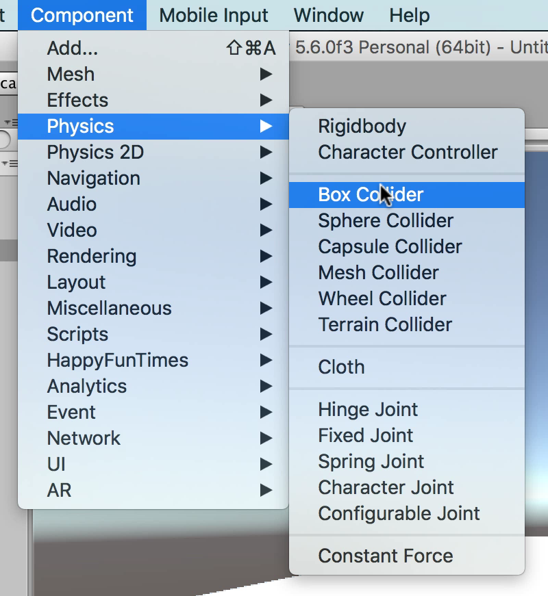

* Set the Box center and size. center = `x:0, y:-0.5, z:0`, size = `x:10, y:1, z:10`

  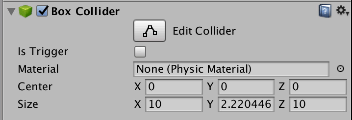

* Run it

  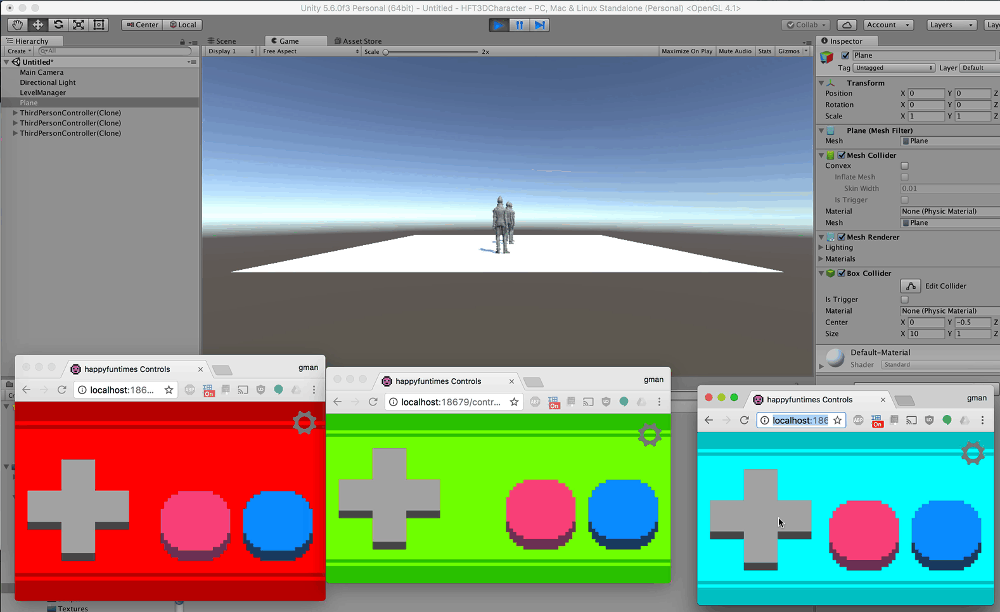

Hopefully that shows how simple it is to get started.

## Colors and Names

Let's had a little more code to show names and colors.

<a href="assets/3d-step2-diff.html">Here are the changes to the script (click here for a new tab)</a>.

<iframe src="assets/3d-step2-diff.html" width="900" height="500"></iframe>

We added a `nameTransform` Transform public field. We need to set that to a transform **inside the prefab**
so we'll follow these steps

1.  Drag the `ThirdPersonController` prefab into the scene hierarchy
2.  Create a GameObject.
3.  Drag the GameObject under the root of the prefab
4.  Rename it to `name` (or anything)
5.  Move it above the character's head
6.  Drag it to the `Name Transform` field of our `ThirdPersonUserControlHFT` script.
7.  From the menus pick `GameObject->Apply Changes to Prefab`
8.  Delete the prefab from the scene

Here's a silent video of the steps

<iframe width="853" height="480" src="https://www.youtube.com/embed/Sp2-vWM14_M" frameborder="0" allowfullscreen></iframe>

Now run it. There should be a "name" box showing the players name in a color matching
the player's controller.

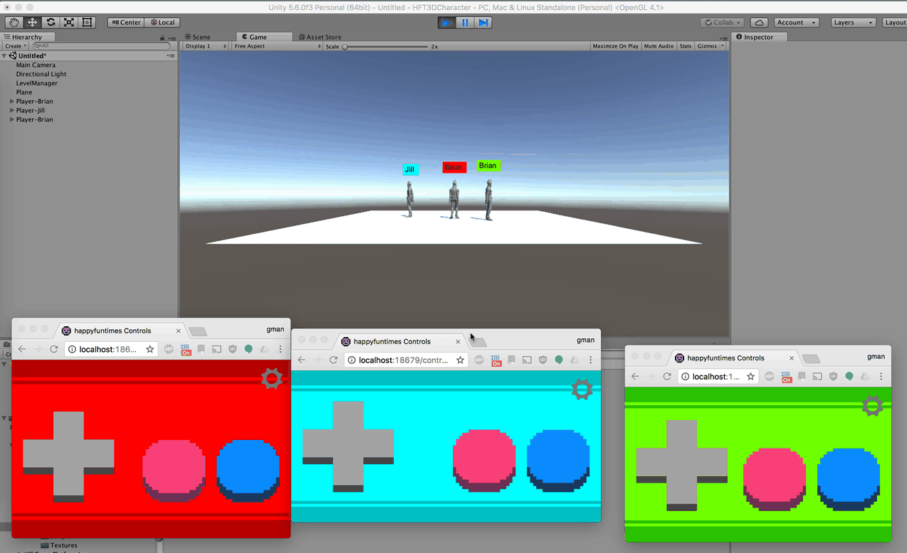

**NOTE**, this way of showing names is **not** the recommended Unity way. The point of this example
is to show how to use HappyFunTimes to set colors and read names, **not how to use Unity**.
To display names the Unity way please [search for examples](https://www.google.com/search?q=displaying+a+name+above+a+character+unity).

Similarly in the example above all players spawn at the same place and if they fall over the edge
of the world they fall forever. [Spawning at random locations](https://www.google.com/search?q=unity+spawn+at+random+location)
and [dying or resetting if the player falls off the world](https://www.google.com/search?q=reset+when+player+falls+of+world+unity)
are standard Unity game development issues and have nothing to do with HappyFuntTimes.
While I want to be helpful I can't teach you Unity. I can only teach you HappyFunTimes. For Unity issues
please use the [Unity Forums](https://forum.unity3d.com/) and/or [Unity Answers](http://answers.unity3d.com/).
Also see the samples.

The Simple and Clean examples in `Assets/HappyFunTimes/MoreSamples` spawn players at random locations given a globally defined area.
For Spawn points you can apply ideas from the example above. On the LevelManager (or some global object)
you make an array of `Transform`s. `public Transform[] spawnPoints;`
You then make a bunch of GameObjects, as many as you want, one for each spawn point and add them to the list
of spawn points on the LevelManager in Unity just like we added the `name` GameObject to the `nameTransform` above. When a player
is added, then in their `Start` method (or `InitNetPlayer` functions if you're not using the HFTGamepad/HFTInput)
you'd find that list from the LevelManager and either pick one of the spawn points at random or pick the next one or whaever fits
your game. Again, these are Unity game development issues not HappyFunTimes issues. I hope that doesn't
come across as harsh but I also hope you see my point.

