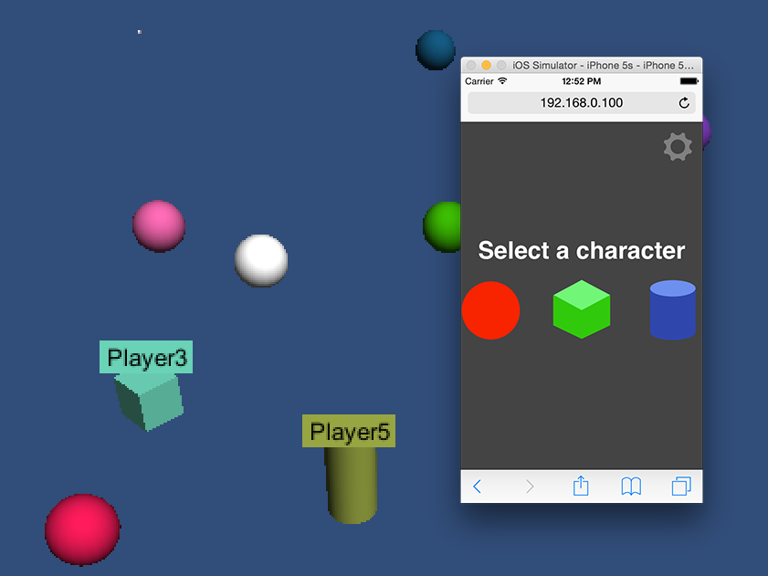
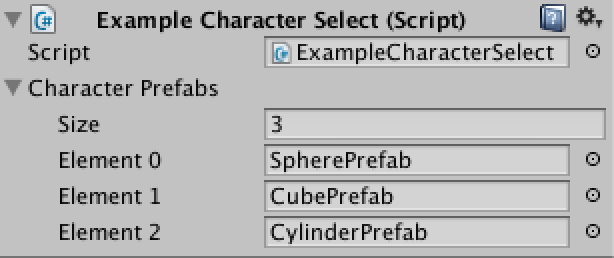
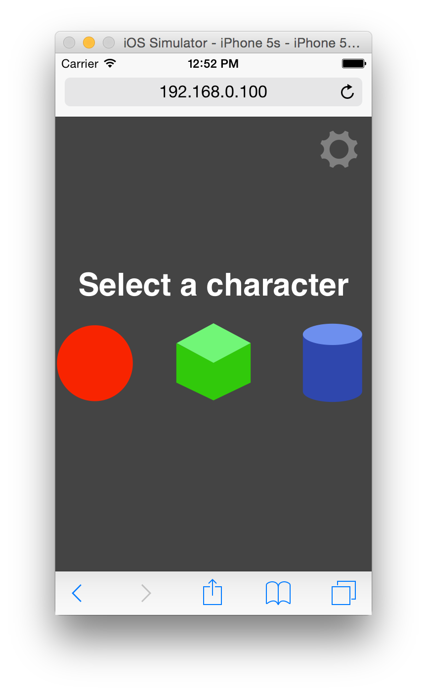

Title: Character Selection
Description: Selecting Characters on the Phone and then spawning the corresponding prefab in Unity

This is just one example. Selecting characters is a very game specific feature so it's hard to give a
specific answer. Do you have just 2 characters? That's relatively easy as you can put 2 images
of 2 characters on your controller. Do you have 50 characters? Well now you need to put 50
images. Since 50 images probably won't fit on the phone you're going to have to design some
kind of selection UI. Do you want users to select clothing, weapons, armor? Now you're going to
have to make a relatively complex UI on the controller and send all of the user's selections
to the game. Do you want players to be able to change characters during play. Again that's
up to you to create. HappyFunTimes will just let you communicate between the game and
the controller/phone..

To keep it simple though here's one example of letting players pick characters.

Open the scene `Assets/HappyFunTimes/MoreSamples/character-select/Scenes/HappyFunTimesCharacterSelectExample`.
You can [download this sample here](http://docs.happyfuntimes.net/docs/unity/samples.html?owner=greggman&repo=hft-unity3d).
The description below closely follows that scene.

Using the default `PlayerSpawer` script make a prefab that is just a single GameObject with
just one script. That script waits for a message from the controller as to which character
the player picked. It then spawns yet another prefab based on the player's selection and
passes the `NetPlayer` to that new prefab.

So for example here's a script.

    // ExampleCharacterSelect.cs
    using UnityEngine;
    using System;
    using HappyFunTimes;

    class ExampleCharacterSelect : MonoBehaviour {

        public GameObject[] characterPrefabs = null;

        // Message received from controller about which
        // character the player picked.
        private class MessageCharacter {
            public int id = 0;
        }

        void InitializeNetPlayer(SpawnInfo spawnInfo) {
            // Save the netplayer object so we can use it send messages to the phone
            m_netPlayer = spawnInfo.netPlayer;

            // Register handler to call if the player disconnects from the game.
            m_netPlayer.OnDisconnect += Remove;

            // Setup events for the different messages.
            m_netPlayer.RegisterCmdHandler<MessageCharacter>("character", OnCharacter);
        }

        private void Remove(object sender, EventArgs e) {
            Destroy(gameObject);
        }

        private void OnCharacter(MessageCharacter data) {
            int ndx = data.id;
            if (ndx < 0 || ndx >= characterPrefabs.Length) {
                Debug.LogError("invalid charater selection: " + ndx);
                return;
            }

            // The ExampleCharacterSelect GameObject no longer
            // needs to care about m_netPlayer
            m_netPlayer.OnDisconnect -= Remove;
            m_netPlayer.UnregisterCmdHandler("character");

            // Create the character
            GameObject newGameObject = (GameObject)Instantiate(characterPrefabs[ndx]);

            // Send the netplayer to the character. We use a message
            // because then every character can have a differnet script if we want.
            newGameObject.SendMessage("InitializeNetPlayer", m_netPlayer);

            // We're done. Destory ourselves
            Destroy(gameObject);
        }

        private NetPlayer m_netPlayer;
    }

Put it on an empty GameObject. Make it a prefab. Make the happyfuntimes `PlayerSpawner` spawn it.

This script has an array of GameObjects. Put the prefabs you want spawned for each type of character
in the slots shown in Unity

After that you need to make a controller that lets the user select a character
and sends a message to the game about which character was selected.

I made one by modifying the [simple](basic.md) controller.

Relevant HTML in `Assets/WebPlayerTemplates/HappyFunTimes/character-select/controller.html`

    

      <h1 id="gamestatus">status</h1>
      

        
Touch to Move

      

      

    

    

      
Select a character

        

          

          

          

        

    

Relevent CSS in `Assets/WebPlayerTemplates/HappyFunTimes/character-select/css/controller.css`

    #choose {
        z-index: 20;
        position: absolute;
        top: 0;
        left: 0;
        width: 100%;
        height: 100%;
        background-color: #444;
        color: white;
        font-size: xx-large;
        font-weight: bolder;
        font-family: sans-serif;
    }
    #choices {
        display: -webkit-flex;
        display: flex;
        -webkit-justify-content: space-around;
        justify-content: space-around;
    }
    .choice {
        width: 120px;
        height: 120px;
    }
    img {
        width: 100%;
        height: 100%;
        -moz-user-select: none;
        -webkit-user-select: none;
        -o-user-select: none;
        user-select: none;
        pointer-events: none;
    }

It shows up like this

I then added code to send which character the user selected. You can see it
in `Assets/WebPlayerTemplates/HappyFunTimes/character-select/scripts/controller.js`
It also hides the selection HTML which was covering up the normal game controls.

      function selectCharacter(id) {
        // only do this once
        if (choice < 0) {
          choice = id;
          // Send the character choice to the game
          client.sendCmd('character', { id: id });
          // Hide the choose HTML
          document.getElementById("choose").style.display = "none";
        }
      }

      var $ = document.getElementById.bind(document);
      $("choice0").addEventListener('click', function() { selectCharacter(0); });
      $("choice1").addEventListener('click', function() { selectCharacter(1); });
      $("choice2").addEventListener('click', function() { selectCharacter(2); });
      $("choice0").addEventListener('touchstart', function() { selectCharacter(0); });
      $("choice1").addEventListener('touchstart', function() { selectCharacter(1); });
      $("choice2").addEventListener('touchstart', function() { selectCharacter(2); });

Run the scene `Assets/HappyFunTimes/MoreSamples/character-select/Scenes/HappyFunTimesCharacterSelectExample`
to see it work.
