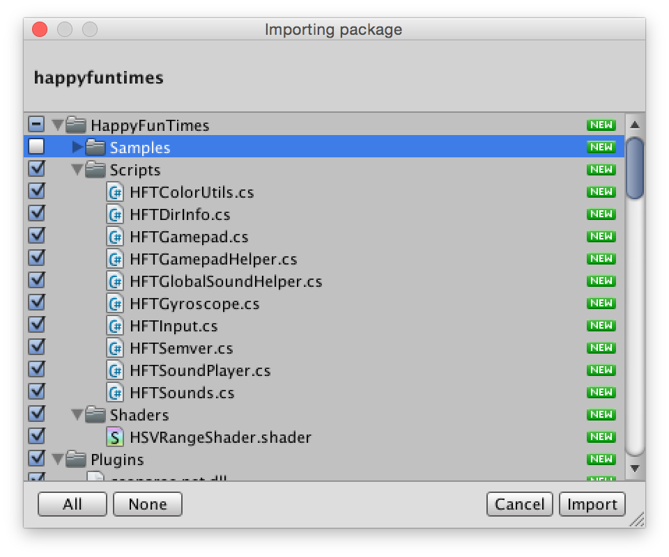
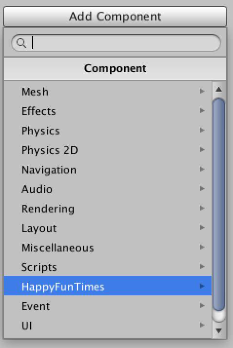
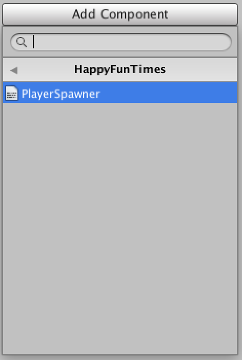
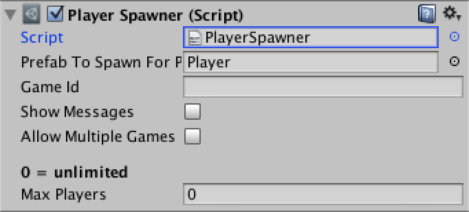
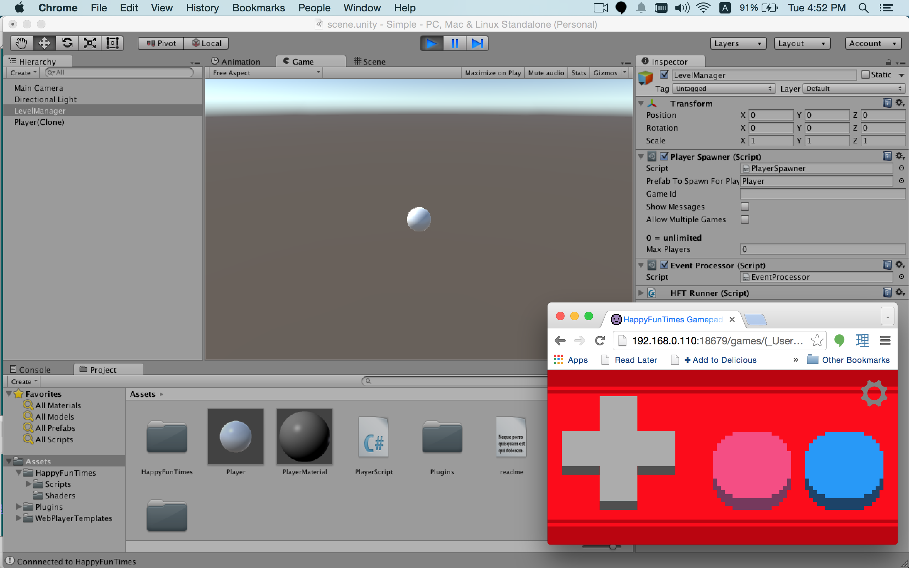
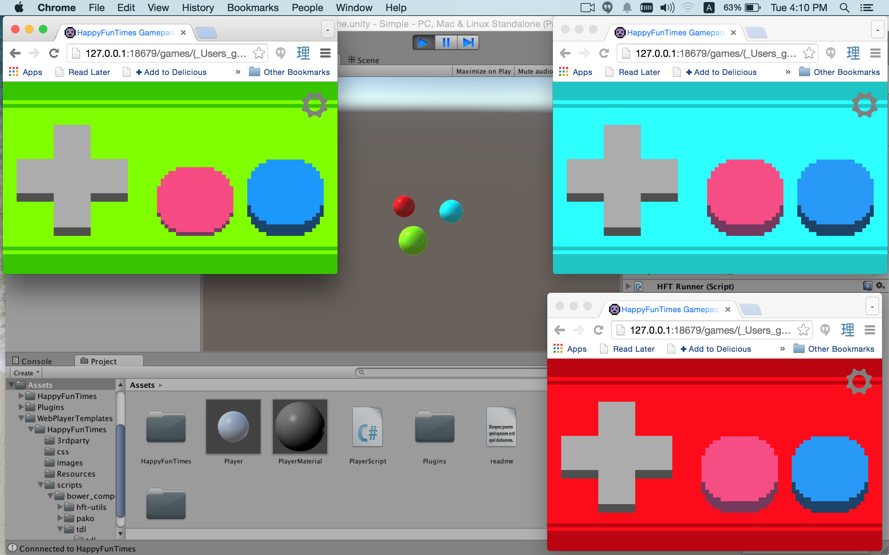

Title: Your First HappyFunTimes Unity Game
Description: How to make a game with HappyFunTimes and Unity

<iframe width="853" height="480" src="https://www.youtube.com/embed/7jCNm9ZxzUY?rel=0" frameborder="0" allowfullscreen></iframe>

See the video above for a demonstration of these steps

## First let's make the simplest *non* happyfuntimes example I can think of.

1.  Make a new scene in Unity

2.  Create a Sphere and name it "Player" (or whatever you want)

    This will be our player

3.  Add new Script Component and edit the script. Make the code look like this

        using UnityEngine;
        using System.Collections;

        public class PlayerScript : MonoBehaviour {

            public float speed = 4.0f;

            // Use this for initialization
            void Start () {

            }

            // Update is called once per frame
            void Update () {
                float dx = speed * Input.GetAxis("Horizontal") * Time.deltaTime;
                float dz = speed * Input.GetAxis("Vertical")   * Time.deltaTime;
                transform.position = transform.position + new Vector3(dx, 0.0f, dz);
            }
        }

4.  Select the `Main Camera` and choose `GameObject->Align With View` from the menus

5.  Run it

We now have a simple working game. Use the arrow keys to control the sphere.

## Add in HappyFunTimes

Let's make our sample work with HappyFunTimes

1.  [Import the HappyFunTimes plugin]((https://www.assetstore.unity3d.com/en/#!/content/19668)
    but don't include the samples.

    

2.  Add the HFTInput script component to the Player

3.  In the `PlayerScript`, in  `Start` Look up the `HFTInput` component we just added

        private HFTInput m_hftInput;

        // Use this for initialization
        void Start () {
            m_hftInput = GetComponent<HFTInput>();
        }

4.  Modify `Update` to also use `m_hftInput`.

        // Update is called once per frame
        void Update () {
            float dx = speed * (m_hftInput.GetAxis("Horizontal") + Input.GetAxis("Horizontal")) * Time.deltaTime;
            float dz = speed * (m_hftInput.GetAxis("Vertical")   + Input.GetAxis("Vertical")  ) * Time.deltaTime;
            transform.position = transform.position + new Vector3(dx, 0.0f, dz);
        }

6.  Turn the player into a prefab (drag it to the project) and delete it from the scene.

7.  Make new GameObject and name it `LevelManager`

8.  Add the HappyFunTimes `PlayerSpawner` to the `LevelManager`

     

9.  Set the `Prefab To Spawn For Player` to the player prefab

    

10. Run it

11. Open a new browser window (Ctrl-N or Cmd-N) and then go to `http://localhost:18679`

    Size the browser window so you can see unity.

You should see that pressing the D-Pad in the browser controls the sphere. Try
opening more browser windows and you'll see more spheres. If you want, get out
your phone and go to `happyfuntimes.net` and as long as your phone and computer
are on the same WiFi you should see another sphere appear. Note they all start
at the same location so you need to move them to see them.

## Setting the Color

One problem right now is all the spheres are the same color. Let's fix that

1.  In `Start` look up the `HFTGamepad` component.

    It was automatically added for you when you added the `HFTInput` component.

        private HFTInput m_hftInput;
        private HFTGamepad m_gamepad;

        // Use this for initialization
        void Start () {
            m_hftInput = GetComponent<HFTInput>();
            m_gamepad = GetComponent<HFTGamepad>();
        }

2.  Also in `Start` look up the renderer component and set its material's color
    to the color the gamepad chose.

        // Use this for initialization
        void Start () {
            m_hftInput = GetComponent<HFTInput>();
            m_gamepad = GetComponent<HFTGamepad>();

            Renderer renderer = GetComponent<Renderer>();
            renderer.material.color = m_gamepad.color;
        }

3.  Create a new Material and assign it to the player prefab

4.  Run it

You should see each sphere matches the color of the controller that connects it.
If you want to pick colors yourself you can also set `m_gamepad.color` to some
color and the controller will change color.

## The Gamepad API

`HFTGamepad` implements the Unity side of the sample gamepad controller.
For a more through explanation of how to use it [see "Unity3D HappyFunTimes Gamepad"](gamepad.md).

## Be Creative

I hope this demonstrated how easy it is to get started with HappyFunTimes.

The sample controller here is just that, a sample. Feel free to change it
or add any other features need. Don't limit yourself to the sample controllers.
You can make the phones do all kinds of things. To see how to make controllers
from scratch dig through the code in `Assets/HappyFunTimes/Script/HFTGamepad.cs`
and `Assets/WebPlayerTemplates/HappyFunTimes/controllers/gamepad/controller.js` and
[see this document](basics.md).

Other controllers pairs are found in

The simple controller

    Assets/HappyFunTimes/MoreSamples/simple/Scripts/ExampleSimplePlayer.cs
    Assets/WebPlayerTemplates/HappyFunTimes/controllers/simple/scripts/controller.js

The character-select controller

    Assets/HappyFunTimes/MoreSamples/simple/Scripts/ExampleCharacterSelect.cs
    Assets/HappyFunTimes/MoreSamples/simple/Scripts/ExampleCharacterSelectPlayer.cs
    Assets/WebPlayerTemplates/HappyFunTimes/controllers/character-select/scripts/controller.js
