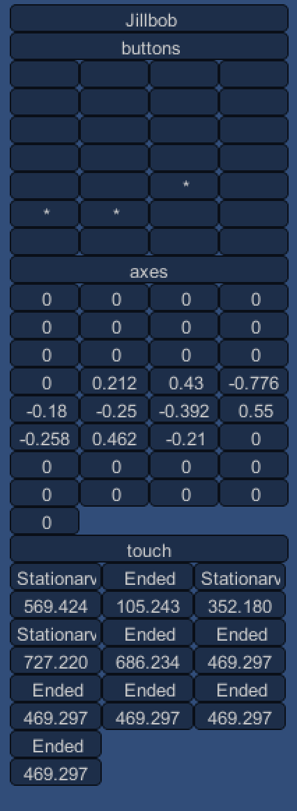
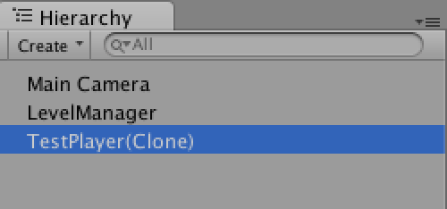
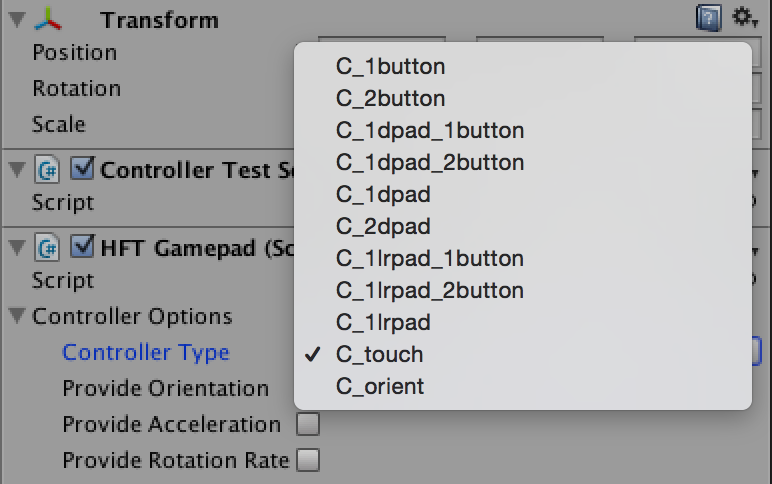

Title: Reading Multi-Touch
Description: How to get multi-touch data from the phone

I want to be clear, if you're going to do multi-touch you should really consider
creating a custom controller. [See below](#caution). This document is specifically
about multi-touch support from the sample [Gamepad controller](gamepad.md)

## HFTInput

The `HFTInput` component supports the standard unity `Input.touches` [see docs](http://docs.unity3d.com/ScriptReference/Input-touches.html)
and `Input.GetTouch` function [see docs](http://docs.unity3d.com/ScriptReference/Input.GetTouch.html).

In other words, like it's explained in "[Your First HappyFunTimes Game](first-game.md) you look up the `HFTInput` component in your `Start`
function

    private HFTInput m_hftInput;

    // Use this for initialization
    void Start () {
        m_hftInput = GetComponent<HFTInput>();
    }

And then anywhere you'd use `Input.something` you instead use `m_hftInput.something`.

**Note**: `HFTInput`'s touch functions return `HFTInput.Touch` objects, not Unity `Touch` objects.

**Note**: The `Touch.rawPosition` is currently in screen pixels of the Unity game
not the controller.

The Unity `Input` API says those values are in pixels but they are
assuming the game is running on the phone. In the case of HappyFunTimes
each phone is different so having it be in phone screen pixels
would make no sense unless you also knew the resolution of each phone.
The controller could provide that info but that would make it more complicated for you.

Personally I'd prefer normalized values (0.0 to 1.0). If you want those
then take  `Touch.rawPosition` and divide `x` by `Screen.width` and `y` by `Screen.height`
as in

    HFTInput.Touch touch = m_hftInput.GetTouch(0);
    float normalizedX = touch.x / Screen.width;
    float normalziedY = touch.y / Screen.height;

## HFTGamepad

The second way of getting multi-touch data is looking up buttons an axes on an `HFTGamepad` component.

Look up `HFTGamepad` component in your `Start` function.

    private HFTGamepad m_gamepad;

    // Use this for initialization
    void Start () {
        m_gamepad = GetComponent<HFTGamepad>();
    }

Then read the correct axes and buttons for each touch

    void Update() {

       // check if first touch is pressed
       if (m_gamepad.button[HFTGamepad.BUTTON_TOUHCH0]) {
          // Get the normalized touch position (0 to 1)
          float x = m_gamepad.axes[HFTGamepad.AXIS_TOUCH0_X];  // range -1.0 to +1.0
          float y = m_gamepad.axes[HFTGamepad.AXIS_TOUCH0_Y];  // range -1.0 to +1.0
       }

       // check if second touch is pressed
       if (m_gamepad.button[HFTGamepad.BUTTON_TOUHCH1]) {
          // Get the normalized touch position (0 to 1)
          float x = m_gamepad.axes[HFTGamepad.AXIS_TOUCH1_X];  // range -1.0 to +1.0
          float y = m_gamepad.axes[HFTGamepad.AXIS_TOUCH1_Y];  // range -1.0 to +1.0
       }

       ...etc...

Up to ten touches are supported (limited of course by the phone and the browser's touch support)

        HFTGamepad.AXIS_TOUCH0_X
        HFTGamepad.AXIS_TOUCH0_Y
        HFTGamepad.AXIS_TOUCH1_X
        HFTGamepad.AXIS_TOUCH1_Y
        HFTGamepad.AXIS_TOUCH2_X
        HFTGamepad.AXIS_TOUCH2_Y
        HFTGamepad.AXIS_TOUCH3_X
        HFTGamepad.AXIS_TOUCH3_Y
        HFTGamepad.AXIS_TOUCH4_X
        HFTGamepad.AXIS_TOUCH4_Y
        HFTGamepad.AXIS_TOUCH5_X
        HFTGamepad.AXIS_TOUCH5_Y
        HFTGamepad.AXIS_TOUCH6_X
        HFTGamepad.AXIS_TOUCH6_Y
        HFTGamepad.AXIS_TOUCH7_X
        HFTGamepad.AXIS_TOUCH7_Y
        HFTGamepad.AXIS_TOUCH8_X
        HFTGamepad.AXIS_TOUCH8_Y
        HFTGamepad.AXIS_TOUCH9_X
        HFTGamepad.AXIS_TOUCH9_Y

        HFTGamepad.BUTTON_TOUCH0
        HFTGamepad.BUTTON_TOUCH1
        HFTGamepad.BUTTON_TOUCH2
        HFTGamepad.BUTTON_TOUCH3
        HFTGamepad.BUTTON_TOUCH4
        HFTGamepad.BUTTON_TOUCH5
        HFTGamepad.BUTTON_TOUCH6
        HFTGamepad.BUTTON_TOUCH7
        HFTGamepad.BUTTON_TOUCH8
        HFTGamepad.BUTTON_TOUCH9

You can see this in action by opening the `ControllerTestScene` in `Assets/HappyFunTimes/Samples/Scenes`
included with the plugin. Run it. For each phone you connect you should see all of the buttons and axes.

To see the touch inputs select one of the connected phone's in the scene

And set the `controller type` to `c_touch`

## Caution! Optimize your controller!

Multi-touch in the sample Gamepad controller is really just there for you to play with. For a 1-4 player
game it might be fine but if you'd 40 players each sending 5 to 10 fingers of input every frame you're
quickly going to run out of bandwidth

The truth is if you really want to do something fancy with touch controls you should create a custom controller.
By that I mean you should edit or better copy `Assets/WebPlayerTemplates/HappyFunTimes/controllers/gamepad/scripts/controller.js`
and `Assets/WebPlayerTemplates/HappyFunTimes/controllers/gamepad/controller.html` and process touch events in JavaScript on the phone.
Figure out as much on the phone as you can and then only send the result to the game. For example lets say you wanted
the phone to look like a slingshot. You should actually draw the band of the sling shot on the phone
in JavaScript. Do touch processing on the phone to stretch the band to where the player is putting their
finger and when they finally lift their finger just send the tension and direction to the game and maybe
the orientation. That would keep communication between the game and the phone to a minimum and help ensure
a good experience.
