Title: Unity3D HappyFunTimes Gamepad
Description: Using the Gamepad Example

The Unity Gamepad example is easiest way to get started with HappyFunTimes in Unity.
It provides a bunch of different pre-made controllers with options for a touch controls
and for orientation data. Normally it would be up to you to create the controller,
the part that runs on the phone, but using this sample is a good way to skip
that part if you're looking to get started with HappyFunTimes as quickly as possible.

Once you get the hang of it feel free to modify this sample for new features
or look at one of the many other samples. For example if you want to see how a controller
(the part on the phone) actually works [check out the 2d platformer example](2d-platformer.md)

This sample is included with the [Unity HappyFunTimes plugin](https://www.assetstore.unity3d.com/en/#!/content/19668).
Or, you can [download the plugin here](http://docs.happyfuntimes.net/docs/unity/samples.html?owner=greggman&repo=hft-unity3d).

## Explaination of the code

There are several samples, the one is basically [the 2D platformer example](https://unity3d.com/learn/tutorials/modules/beginner/2d) from the
unity website with HappyFunTimes control added. If you haven't gone through those tutorials I suggest you do that first
so you have some idea of what's happening in unity.

Load the scene from `HappyFunTimes/Samples/Scenes/2dPlatformScene`.
Follow below for an explaintion of the HappyFunTimes parts

### LevelManager / PlayerSpawer

Select the `LevelManager` object from the scene.

Notice the `PlayerSpawer`. `PlayerSpawner` is a standard HappyFunTimes component. There should
only be one per scene. It spawns a prefab each time a player connects to HappyFunTimes with their phone.

You can see the spawns the prefab `Character`.

### Character

Select the `Character` prefab from `HappyFunTimes/Samples/Prefabs/Character`

Looking inside the character you can see it uses 3 scripts. One
is `HFTGamepad` script.

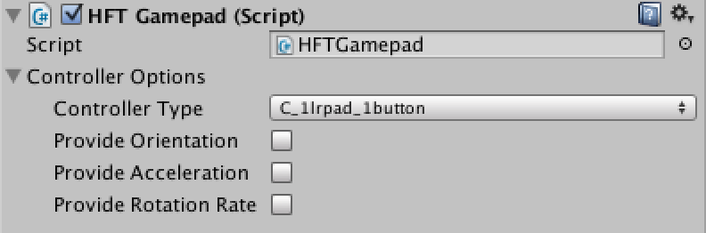

#### HFTGamepad

The HFTGamepad script lets you select the type of controller you
want for your game. The 11 types are

  <figure>
    <figcaption>1button</figcaption>
    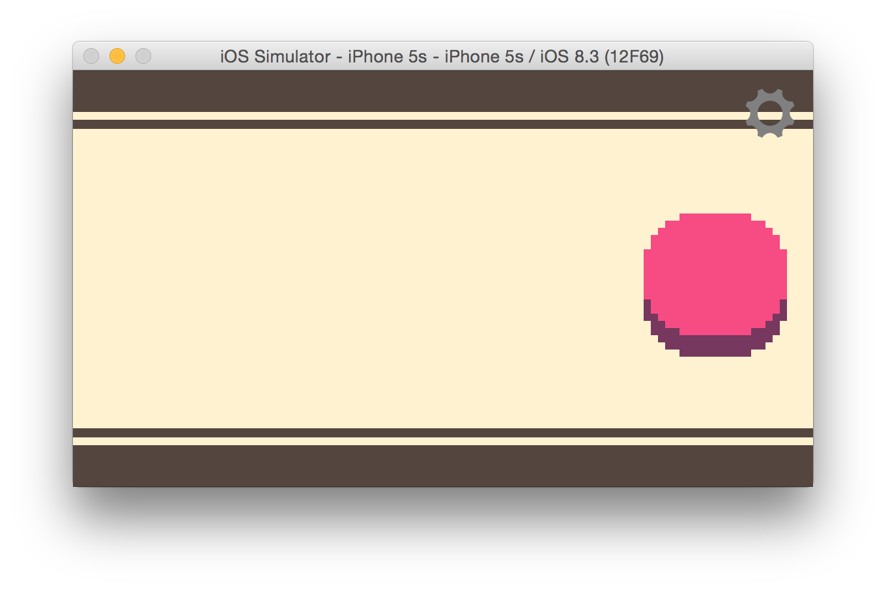
  </figure>
  <figure>
    <figcaption>2button</figcaption>
    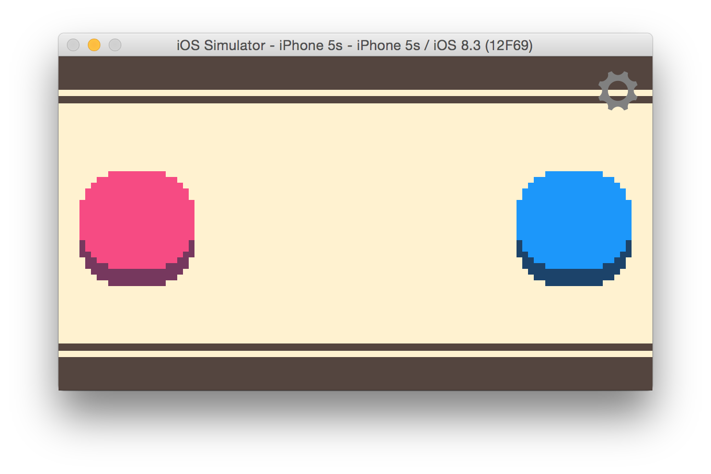
  </figure>
  <figure>
    <figcaption>1dpad-1button</figcaption>
    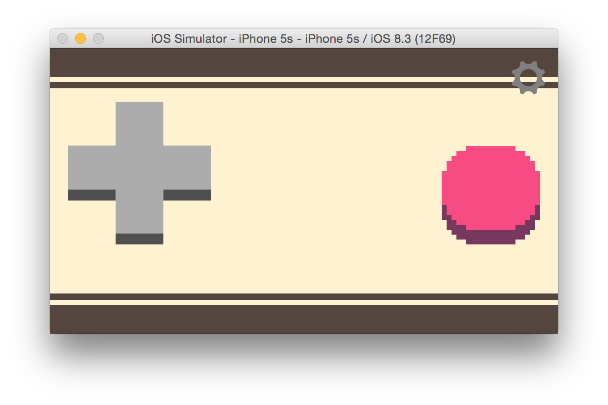
  </figure>
  <figure>
    <figcaption>1dpad-2button</figcaption>
    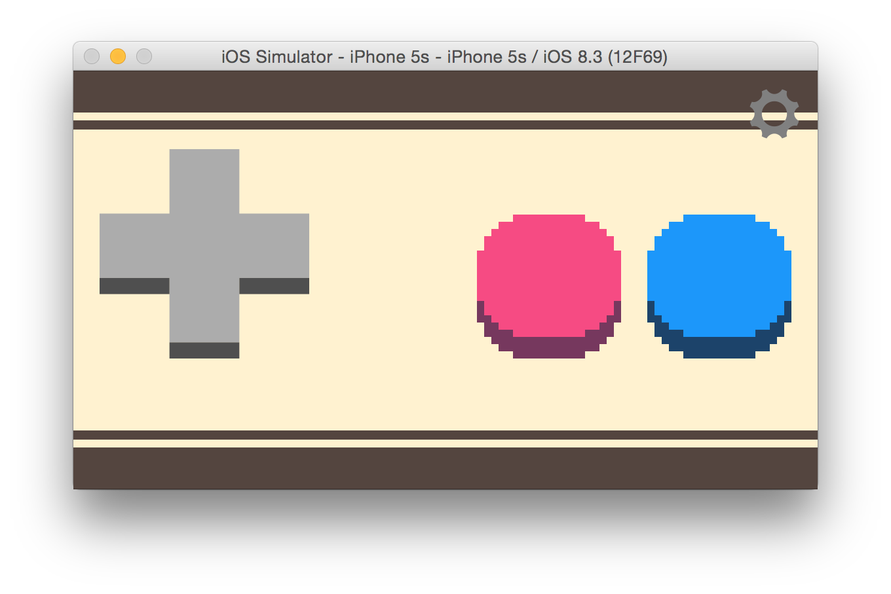
  </figure>
  <figure>
    <figcaption>1dpad</figcaption>
    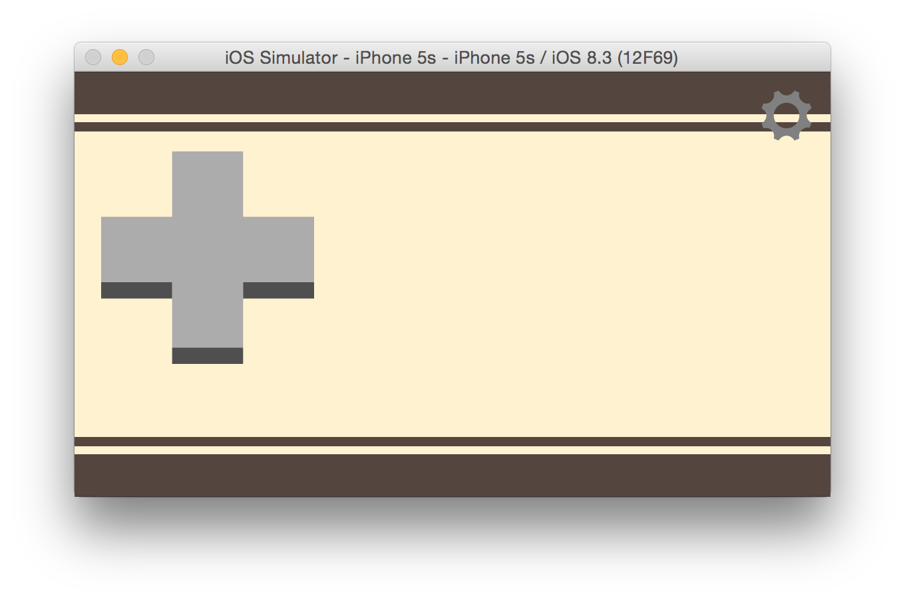
  </figure>
  <figure>
    <figcaption>2dpad</figcaption>
    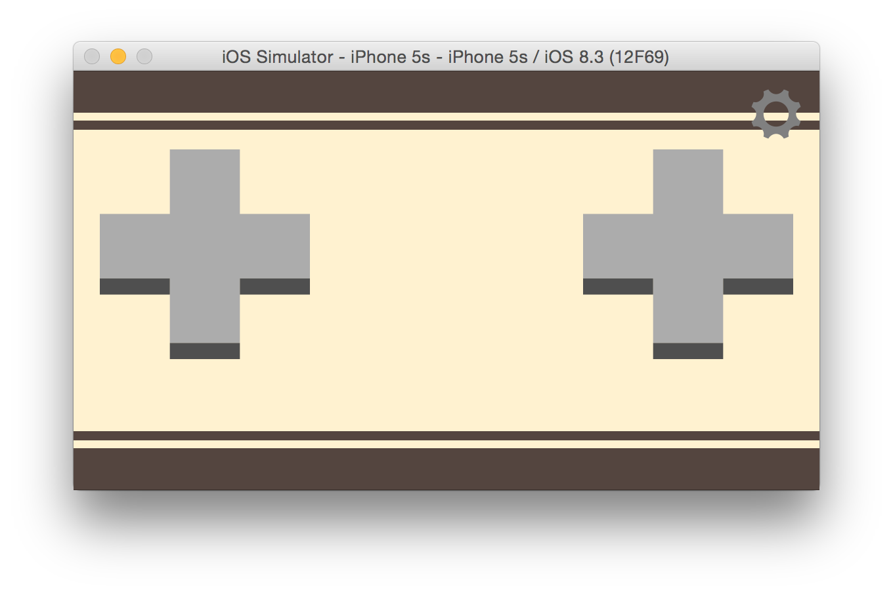
  </figure>
  <figure>
    <figcaption>1lrpad-1button</figcaption>
    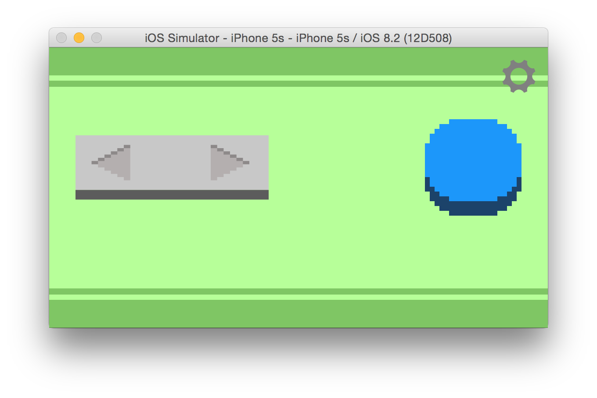
  </figure>
  <figure>
    <figcaption>1lrpad-2button</figcaption>
    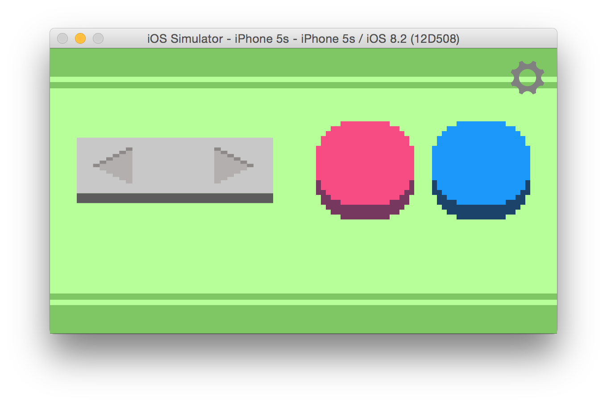
  </figure>
  <figure>
    <figcaption>1lrpad</figcaption>
    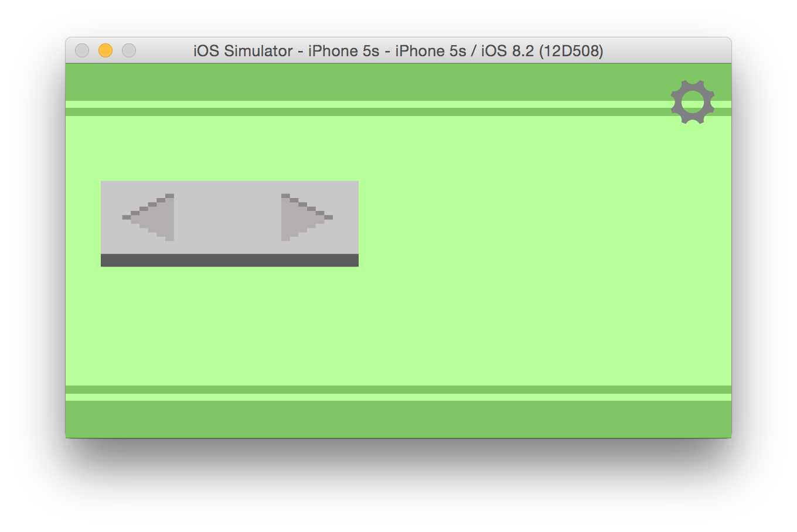
  </figure>
  <figure>
    <figcaption>touch</figcaption>
    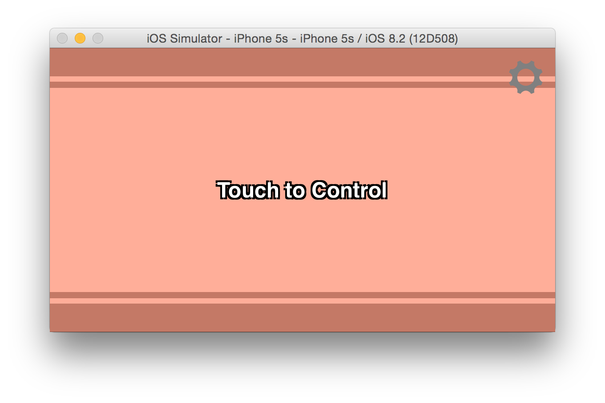
  </figure>
  <figure>
    <figcaption>orient</figcaption>
    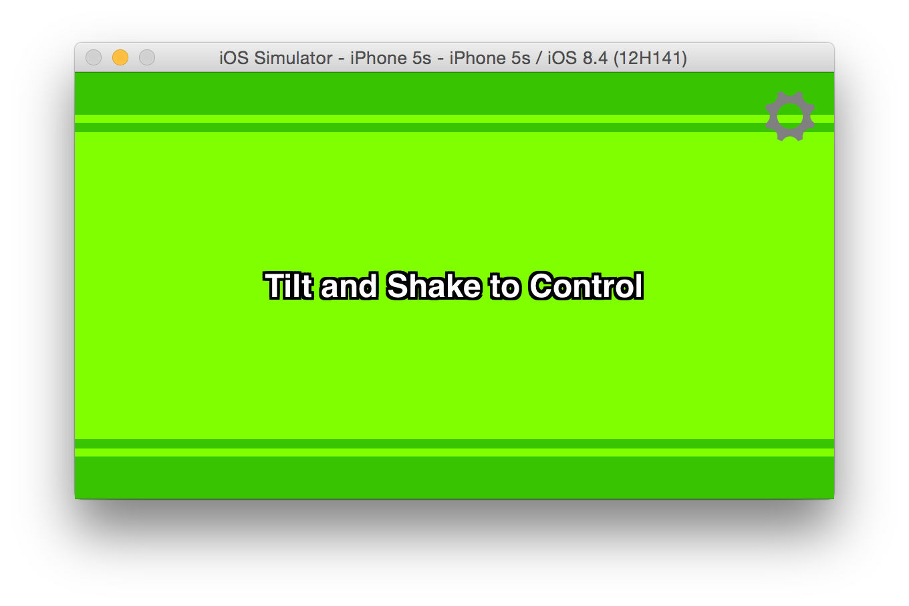
  </figure>

You can see for this sample we've select the `1lrpad-1button` controller.

The other 3 checkboxes let you get orientation data from the phone. [See below](#hft-gamepad-api)

#### HFTInput

Another script is the `HFTInput` script. The `HFTInput` script coordinates with
the `HFTGamepad` script to emulate [the standard Unity `Input` class](http://docs.unity3d.com/ScriptReference/Input.html)
Most places that you'd use `Input` you can use `m_hftInput` instead. See Below.

Whether you use `HFTInput` or not is up to you. `HFTGamepad` provides the real
gamepad support. `HFTInput` just looks at the data from `HFTGamepad` and
makes it look similar to the standard `Input` system.

#### BirdScript

`BirdScript.cs` is basically [the same code from the unity tutorial](https://unity3d.com/learn/tutorials/modules/beginner/2d)
with a few additions for HappyFunTimes

##### Start

Our standard unity `Start` function looks up several components including the `HFTGamePad` and `HFTInput` components.
It then sets the color, get's the user's name, and sets up callbacks for if the user changes their name or
disconnets from the game.

    private Animator m_animator;
    private Rigidbody2D m_rigidbody2d;
    private Material m_material;
    private HFTGamepad m_gamepad;
    private HFTInput m_hftInput;
    private static int m_playerNumber = 0;

    void Start ()
    {
        m_animator = GetComponent<Animator>();
        m_rigidbody2d = GetComponent<Rigidbody2D>();
        m_material = GetComponent<Renderer>().material;
        m_gamepad = GetComponent<HFTGamepad>();
        m_hftInput = GetComponent<HFTInput>();

        SetColor(m_playerNumber++);
        SetName(m_gamepad.Name);

        // Notify us if the name changes.
        m_gamepad.OnNameChange += ChangeName;

        // Delete ourselves if disconnected
        m_gamepad.OnDisconnect += Remove;
    }

Another thing to notice is that we have `static` `m_playerNumber` property. Because it's
static it is shared with all other BirdScript instances. We use that to help pick
a color for each player. We could just pick at random but I've found far too often
the colors come out too close so the code here that picks a color only picks from
one of 64 colors and it starts them out with very distant colors.

##### SetColor

Setting the color used for the character is a little funky. We're using
[an HSVA shader that lets us selectively adjust the hue, saturation, and value of part
of an image based on a hue range](https://github.com/greggman/hsva-unity). We need to
know the base color of the character so we can then apply the adjustments to that
color and calculate what the final color becomes. That color is set manually in Unity.

If that's not clear let's assume the Bird's default color is bluish. We then choose to
adjust the hue by 0.5 giving us a red/orange. Without knowing that the base color is blue
we couldn't know what color it will become after its been adjusted and so we would not
know what color to send to the controller. Setting the base color to the color of the
player's sprite graphics lets us comupte what color it will become.

Based on the player number which we use as `colorNdx` we pick a player color. The goal is to pick something
that is different from other players. To do that we reverse the least significant
6 bits which means instead of counting 0, 1, 2, 3, 4, 5, 6, 7, 8 we end up counting
0, 32, 16, 48, 8, 40, 24, 56, ...  6 bits means we have a range of 0 to 63 so dividing
by 64 gives us an amount from 0.0 to 1.0 to adjust the hue around the color wheel.

    float hueAdjust = (((colorNdx & 0x01) << 5) |
                       ((colorNdx & 0x02) << 3) |
                       ((colorNdx & 0x04) << 1) |
                       ((colorNdx & 0x08) >> 1) |
                       ((colorNdx & 0x10) >> 3) |
                       ((colorNdx & 0x20) >> 5)) / 64.0f;

These 2 lines make every other set of 32 players be 50% darker
and every other set of 16 players be 50% less saturated.

    float satAdjust   = (colorNdx & 0x10) != 0 ? -0.5f : 0.0f;
    float valueAdjust = (colorNdx & 0x20) != 0 ? -0.5f : 0.0f;

Hopefully that comes up with [good colors](http://greggman.github.io/doodles/picking-colors.html).

The rest seems pretty straight forward. The one HappyFunTimes line
is `m_gamepad.color = playerColor`. Setting `m_gamepad.color` will
tell the controller to change to a matching color.

    // get the hsva for the baseColor
    Vector4 hsva = HFTColorUtils.ColorToHSVA(baseColor);

    // adjust that base color by the amount we picked
    hsva.x += hueAdjust;
    hsva.y += satAdjust;
    hsva.z += valueAdjust;

    // now get the adjusted color.
    Color playerColor = HFTColorUtils.HSVAToColor(hsva);

    // Tell the gamepad to change color
    m_gamepad.color = playerColor];

    // Create a 1 pixel texture for the OnGUI code to draw the label
    Color[] pix = new Color[1];
    pix[0] = playerColor;
    Texture2D tex = new Texture2D(1, 1);
    tex.SetPixels(pix);
    tex.Apply();
    m_guiStyle.normal.background = tex;

    // Set the HSVA material of the character to the color adjustments.
    m_material.SetVector("_HSVAAdjust", new Vector4(hueAdjust, satAdjust, valueAdjust, 0.0f));

Note: The color is also available directly on the `HFTGamepad` as just `color`. You can see this in
the inspector as the game is running. Select a spawned player and adjust their color and you'll see
it affect both the game and their controller live.

##### Reading User Input

[In the original tutorial](https://unity3d.com/learn/tutorials/modules/beginner/2d) there was
only 1 player and it used keyboard input. To read input from the phone we just reference
the `m_hftInput` as well.

So in `Update`

    void Update()
    {
        bool jumpJustPressed = m_hftInput.GetButtonDown("fire1") || Input.GetKeyDown("space");
        // If we're on the ground AND we just pressed jump (or space)
        if (m_grounded && jumpJustPressed)
        {
           ...
        }
    }

And in `FixedUpdate`

    void FixedUpdate () {
        ...
        // Get left/right input (get both phone and local input)
        float move = m_hftInput.GetAxis("Horizontal") + Input.GetAxis("Horizontal");
        ...

Reading both `m_hftInput` and `Input` is just there to make it easy to test, debug, and interate.
We can start unity, open a local browser window and go to `http://localhost:18679`. Once we do that
we can switch back to unity and just press the arrow and space bar to test the game's physics and stuff.
If we stop unity and start it again that local browser will re-connect automatically so we can continue
to test just using the keyboard.

[See below for other inputs](#hft-gamepad-api)

### LevelSettings.cs

The rest of the code in BirdScript should be clear to anyone that's used Unity much or
gone through [the 2d platformer tutorial](https://unity3d.com/learn/tutorials/modules/beginner/2d).
That example made an enclosed world. For me, instead, I just used a few locators. They are
attached to the `LevelSettings.cs` script which is attached to the `LevelManager` object.

If a player falls below the `bottomOfLevel` locator then I just teleport them to spawn point.
For respawn points there is an array of `spawnPoints`. I only made one in this sample.

The code for `LevelSettings.js` adds a `static` accessor, `settings`. This means any other script
can access the global settings using `LevelSettings.settings.<nameOfSetting>`.

For example in `BirdScript.cs` we pick a random spawn point like this

    void MoveToRandomSpawnPoint()
    {
        // Pick a random spawn point
        int ndx = Random.Range(0, LevelSettings.settings.spawnPoints.Length - 1);
        transform.localPosition = LevelSettings.settings.spawnPoints[ndx].localPosition;
    }

And in `FixedUpdate` we check for the players falling below the bottom of the level like this

    if (transform.position.y < LevelSettings.settings.bottomOfLevel.position.y) {
        MoveToRandomSpawnPoint();
    }

## HFTInput

The `HFTInput` class tries to emulate [the standard Unity `Input` class](http://docs.unity3d.com/ScriptReference/Input.html).

So, for every function and property in `Input` there's the corresponding one in `HFTInput`. For example

    Input.GetButton("fire1")

vs

    m_hftInput.GetButton("fire1");

Things like remapping and the Input Manager are not really relevant to HappyFunTimes. If you want to setup your
own mappings you can call

    m_hftInput.SpecifyAxisNameToAxisIndex(name, index);     // for axis controls
    m_hftInput.SpecifyButtonNameToButtonIndex(name, index); // for buttons

For the correct indices see the next section.

## HFT Gamepad API

The `HFTGamePad` script follows the HTML5 convention. I'm not sure there was a good reason
to keep it but this script is based on [the HTML5 version of this gamepad](http://github.com/greggman/hft-gamepad-api)
and it seemed like a good idea to keep the 2 as similar as possible so if new features are
added to one they can hopefully be easily copied to the other.

What that means is `HFTGamepad` has 2 public properties,

    public float[] axes;
    public Button[] buttons;

that work just like the HTML5 Gamepad API

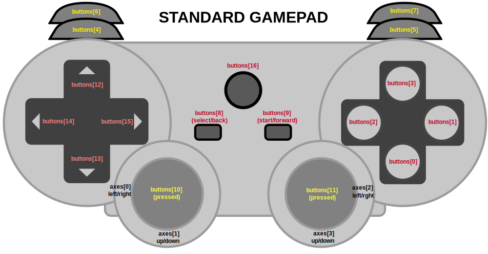

Of course the 10 controller variations don't support all those buttons. What they do support are
2 dpads and 2 buttons plus a few extra things. Here are the constants

    AXIS_DPAD0_X = 0;
    AXIS_DPAD0_Y = 1;
    AXIS_DPAD1_X = 0;
    AXIS_DPAD1_Y = 1;
    AXIS_ORIENTATION_ALPHA = 4;    //    0 to 360
    AXIS_ORIENTATION_BETA  = 5;    // -180 to 180
    AXIS_ORIENTATION_GAMMA = 6;    //  -90 to 90
    AXIS_ACCELERATION_X = 7;       // meters per second left & right
    AXIS_ACCELERATION_Y = 8;       // meters per second toward top and bottom of phone
    AXIS_ACCELERATION_Z = 9;       // meters per second forward and back
    AXIS_ROTATION_RATE_ALPHA = 10; // degress per second
    AXIS_ROTATION_RATE_BETA  = 11; //
    AXIS_ROTATION_RATE_GAMMA = 12; //
    AXIS_TOUCH_X = 13;             // -1 to +1 across the screen
    AXIS_TOUCH_Y = 14;             // -1 to +1 down the screen

    BUTTON_DPAD0_LEFT = 14;
    BUTTON_DPAD0_RIGHT = 15;
    BUTTON_DPAD0_TOP = 12;
    BUTTON_DPAD0_BOTTOM = 13;
    BUTTON_DPAD1_LEFT = 18;
    BUTTON_DPAD1_RIGHT = 19;
    BUTTON_DPAD1_TOP = 16;
    BUTTON_DPAD1_BOTTOM = 17;

### Reading the DPads and or LRPads using `HFTGamepad`

So for example if you are using controller type `2dpads` then you can use this to read DPAD0

    m_gamepad.axes[HFTGamepad.AXIS_DPAD0_X]   // returns -1, 0, or 1
    m_gamepad.axes[HFTGamepad.AXIS_DPAD0_Y]   // returns -1, 0, or 1

And this to read DPAD1

    m_gamepad.axes[HFTGamepad.AXIS_DPAD1_X]   // returns -1, 0, or 1
    m_gamepad.axes[HFTGamepad.AXIS_DPAD1_Y]   // returns -1, 0, or 1

Or you can also read the dpads as buttons with

    // dpad0
    m_gamepad.buttons[HFTGamepad.BUTTON_DPAD0_LEFT].pressed  // true if the user is pressing left
    m_gamepad.buttons[HFTGamepad.BUTTON_DPAD0_RIGHT].pressed // true if the user is pressing right
    m_gamepad.buttons[HFTGamepad.BUTTON_DPAD0_UP].pressed    // true if the user is pressing up
    m_gamepad.buttons[HFTGamepad.BUTTON_DPAD0_DOWN].pressed  // true if the user is pressing down

    // dpad1
    m_gamepad.buttons[HFTGamepad.BUTTON_DPAD1_LEFT].pressed  // true if the user is pressing left
    m_gamepad.buttons[HFTGamepad.BUTTON_DPAD1_RIGHT].pressed // true if the user is pressing right
    m_gamepad.buttons[HFTGamepad.BUTTON_DPAD1_UP].pressed    // true if the user is pressing up
    m_gamepad.buttons[HFTGamepad.BUTTON_DPAD1_DOWN].pressed  // true if the user is pressing down

LR pads work exactly the same except they only provide `X` and `LEFT` and `RIGHT` values.

### Reading the Buttons

If you're using a controller with buttons they can be read with

    m_gamepad.buttons[0].pressed  // true if the user is pressing blue button
    m_gamepad.buttons[1].pressed  // true if the user is pressing red button

For the `touch` controller the values are normalized with 0.0 in the center and -1 to 1
at the edges. You probably want to choose some range smaller than that to actually use
because various mobile OSes like to do things near the edge of the
screen like switch apps or make various UI elements appear. You can read the values
at

    m_gamepad.axes[HFTGamepad.AXIS_TOUCH_X]   // returns -1 to 1
    m_gamepad.axes[HFTGamepad.AXIS_TOUCH_Y]   // returns -1 to 1

    m_gamepad.buttons[HFTGamepad.BUTTON_TOUCH] // true if player is touching the screen

#### IMPORTANT! Optimize your controllers!

The touch controller is very data intensive since it is sending the position of the
fingers from every player very quickly. For a small number of players, say 4 to 8
this is unlikely to be an issue. For a large number of players you should consider
making a custom controller.

As an example lets say you wanted to make a hockey game where users touch the screen
and then drag their finger in the direction they want their player to go. You send
all the data to Unity and then compute things in Unity. It works but it's very
inefficient.

Ideally in this case you would create a custom controller in JavaScript that reads the
player's touch events, computes a direction and only sends the direction to Unity.

One direction per player is at least 50% less data than x and y per finger.
You could even decide that for such mushy controls you only need to send the data
at 10hz or even 5hz and players are unlikely to notice the difference. They are sliding on
ice after all.

Even further you could possibly quantize the directions to 8 or 16 values instead
of a fluid angle and send the direction only if it's different from the last time you
sent the direciton.

All of these optimizations would go a long way toward making sure your game can
support more players.

### Orientation Data

If you check `provideOrientation` then the phone will start providing
orientation data.

Imagine the phone in portrait mode lying flat on a table. In that case.

    m_gamepad.axes[HFTGamepad.AXIS_ORIENTATION_ALPHA] = y rotation. eg: rotation on table. Range 0 to 360
    m_gamepad.axes[HFTGamepad.AXIS_ORIENTATION_BETA]  = x rotation. eg: lift the phone to face you or tilt away from you. Range -180 to 180
    m_gamepad.axes[HFTGamepad.AXIS_ORIENTATION_GAMMA] = z rotation. eg: tilt the phone to the left or right. Range -90 to 90

If you check `provideAcceleration` then the phone will provide acceleration data.
All values are in meters per second squared. Note: different phones seem to have different sensitivities.

Imagine the phone in portrait mode lying flat on a table. In that case.

    m_gamepad.axes[HFTGamepad.AXIS_ACCELERATION_X] = x motion: eg moving the phone left to right
    m_gamepad.axes[HFTGamepad.AXIS_ACCELERATION_Y] = y motion: eg moving the phone away from you or toward you (forward and back)
    m_gamepad.axes[HFTGamepad.AXIS_ACCELERATION_Z] = z motion: eg moving the phone above / below the table

If you check `provideRotationRate` then the phone will provide rotation rate data.

All values are in degrees per second. Note: different phones seem to have different sensitivities.

Imagine the phone in portrait mode lying flat on a table. In that case.

    m_gamepad.axes[HFTGamepad.AXIS_ROTATION_RATE_ALPHA] = y rotation. eg: rotation on table.
    m_gamepad.axes[HFTGamepad.AXIS_ROTATION_RATE_BETA]  = x rotation. eg: lift the phone to face you or tilt away from you.
    m_gamepad.axes[HFTGamepad.AXIS_ROTATION_RATE_GAMMA] = z rotation. eg: tilt the phone to the left or right.

I haven't tested this but I suspect the various forms of orientation data use a lot of network
bandwidth because they have to constantly send data where as most of the dpad, lrpad, and button
controllers send very little data.

That means for example if you want to make game with 4 to 8 players and use orientation data it's
probably fine but 50 players might be a little much. Similarly you should only turn on the data
you actually need. Don't just check all 3 boxes if you don't need all 3 types of data.

See above about optimizing your controllers.

Also consider creative game design and making a custom controllers that do more orientation
processing on the phone itself. For example lets say you were making a game like [SpaceTeam](http://www.sleepingbeastgames.com/spaceteam/)
and you wanted to know when the user shakes the phone (meteor) and when the user turns the phone upsidedown (warp).

The brute force way would be to send the orientation data and the acceleration data to the game. A ton of data
would be sent from the phones to the game. But, rather, you could write some JavaScript that detects on the
phone if the user shakes the phone or if the user turns it upside down. Then you just send commands that
pass that info to the game. Sending only the yes/no info of whether the phone is upsidedown or not (true/false)
and if the phone is currently being shaken (true/false) would be orders of magnitude less data.

See other samples about how to make your own controllers.

### Setting the Color of a gamepad

You can set the color of a gamepad by setting `HFTGamepad.color` as in

    m_gamepad.color = new Color(0, 1, 0);  // make the gamepad green

### Getting the Name of the User

`m_gamepad.Name` contains the user's name. If the user changes the name any callbacks
attached to the `OnNameChange` event handler will be called. For example in `BirdScript`
you can see

    void Start() {
       ...
       // Notify us if the name changes.
       m_gamepad.OnNameChange += ChangeName;

And

    // Called when the user changes their name.
    void ChangeName(object sender, System.EventArgs e)
    {
        SetName(m_gamepad.Name);
    }

### Changing the Controller Type

The controller starts in whatever type you set in Unity but if you want you can also
change it at runtime. For example maybe you have a game that uses an LR-PAD while
the player is running across the level but when they die you want to switch the
controller to touch controls to let them control their spirit. You can do that with
code like

    m_gamepad.controllerOptions.controllerType = HFTGamepad.ControllerType.c_touch

Valid controllers types are

    c_1button,
    c_2button,
    c_1dpad_1button,
    c_1dpad_2button,
    c_1dpad,
    c_2dpad,
    c_1lrpad_1button,
    c_1lrpad_2button,
    c_1lrpad,
    c_touch,

## Limiting the number of players

The sample has no limit to the number of players. The limit is only up to your networking equipment.

But, with these relatively large characters and small level you'll quickly find that if you have
too many players it gets impossible to play. If you want to limit the number of players set
the `maxPlayers` setting in the `PlayerSpawner` to something greater than 0.

If you look at the `LevelManager` you'll see that in addition to the `PlayerSpawner` script there is
also a `HFTGamepadHelper` script. That script is also needed to handle telling players
the game is full and they need to wait.

For example if you set `maxPlayers` to 2 and 3 people connect, the 3rd person's phone will
say "Game Full Please Wait". If one of the other players quits their phone will switch to the
current controls.

The `PlayerSpawner` calls `SendMessage("WaitingNetPlayer")` on its own `GameObject`. So as long
as there is some other script attached to the same `GameObject` that has a function called
`WaitingForNetPlayer` it will get called.

Look side `HFTGamepadHelper.cs` to see how it works. All it does is send a message to the controller
called "full". There isn't even any data.

### Changing players manually

Imagine we set `maxPlayers` to 4 and we want it so that when a player dies they are taken
out of the game and the next player waiting is allowed to play. We could do that like this.

Edit `BirdScript` and change the code that check if they fall of the bottom to this

    void FixedUpdate() {
       ...
       if (transform.position.y < LevelSettings.settings.bottomOfLevel.position.y) {
           // Return the player to the queue of waiting players.
           m_gamepad.ReturnPlayer();

           // Destory ourselves
           Destroy(gameObject);

           return;  // because we just destroyed ourselves lets not do anything else.
       }

## BE CREATIVE

Once you get started [please consider getting even more creative](http://blog.happyfuntimes.net/blog/thinking-outside-the-box-making-hft-games/).
and [considering other ideas](../ideas.md). Learn [how HappyFunTimes works at lower-level](basics.md) so you can make your own controllers.

