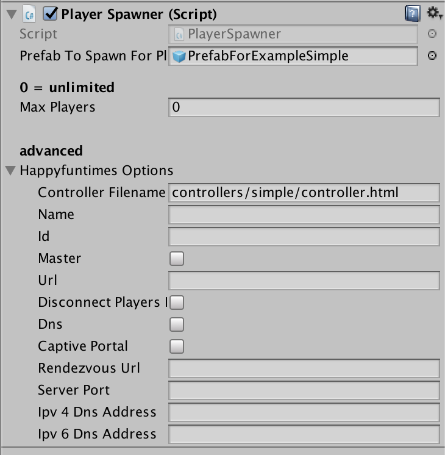

Title: Unity3D HappyFunTimes Options
Description: PlayerSpawner/PlayerConnector options

If you're using the `PlayerSpawner` or `PlayerConnector`
both have a bunch of happyfuntimes options. Usually you
don't have to set any of them but they're there for
special circumstances.

## `Controller Filename`

The path to the file for the controller relative to `Assets/WebPlayerTemplates/HappyFunTimes`

## `Name`

The name to show if there's more than one happyfuntimes game running on the same network.
When player's go to happyfuntimes.net on their phone, if there is more than one game running
on the same local network (for example at a gamejam), the player will be given a list
of games to pick from. The name for each game is, by default, the name of the Unity Project
as set in PlayerSettings->Product Name. Setting it here overrides that default.

## `Id`

... deprecated ...

## `Master`

For [Multi-Machine Games](multi-machine.html) specifies which game players are sent to.

## `Url`

Url to connect to relay server (The server that relays messages between the game and the phones).
Normally you don't need to set this as a game runs it's own server internally inside the HappyFunTimes plugin.
For [multi-machine games](talking-between-games.html) this would normally be set
from the command line.

## `Disconnect Players`

... deprecated ...

## `Dns`

Whether or not to run a DNS server. This is used in [installation mode](../network.html) and
is normally not set manually

## `Captive Portal`

Whether or not to run the captive portal support. This is used in [installation mode](../network.html) and
is normally not set manually

## `Rendezvous Url`

Which external server to tell your local IP address. The default is `http://happyfuntimes.net/api/inform2`.
If you want to run your own [rendezvous server](https://github.com/greggman/happyfuntimes.net) you'd
set this to point to your server.

## `Server port`

The port to use. The default is `18679`

## `Ipv 4 Dns Address`

The local IPv4 address to send. Sometimes you have a complicated network setup on your computer
and happyfuntimes can't figure out which IP address to use. You can set one manually here

## `Ipv 6 Dns Address`

The local IPv4 address to send. Sometimes you have a complicated network setup on your computer
and happyfuntimes can't figure out which IP address to use. You can set one manually here

