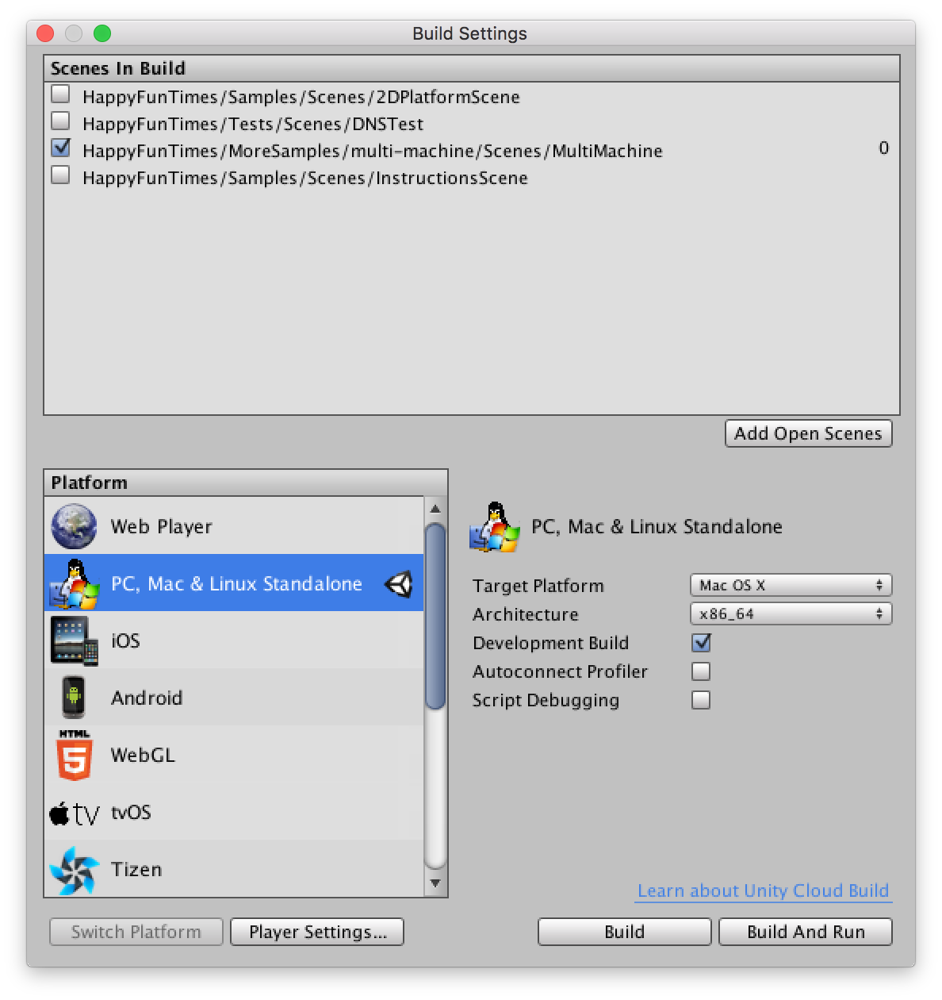

Title: Multiple Computers
Description: How to make a game that runs across mutliple computers.

First off you might be interested in this video to see what running across multiple computers means

<iframe width="853" height="480" src="https://www.youtube.com/embed/aFMNmKYE8KM?rel=0" frameborder="0" allowfullscreen></iframe>

The game above spans 6 monitors. Each monitor has its own computer. Players can jump from monitor
to monitor and walk up and down a large level.

For Unity3D open the `Assets/HappyFunTimes/MoreSamples/multi-machine/Scenes/MultiMachine` scene.

You can run this sample solo in the Unity Editor but to run multiple copies it
 **MUST BE RUN FROM THE COMMAND LINE**. The reason is each instance needs an ID and so
running by clicking an app or from an editor would require editing that id. To run from the command
line you must build an executable.

Pick `File->Build Settings...` from the menus


Make sure the multi-machine scene is the only scene selected.
If it doesn't appear click the `Add Open Scenes` button to add it.



Now click `Build` at the bottom. Save it as `test.app` if you're on OSX or `test.exe` if you're
on Windows.

Then on OSX open the Terminal, cd to the older you exported the game to, then type or copy
and paste each of these lines. You will need to get Unity to run the game in a window.

**Note: It's important to put the `&` at the end of each line**

```
test.app/Contents/MacOS/test --num-games=3 --hft-master --hft-id=game0 &

test.app/Contents/MacOS/test --num-games=3 --hft-url=ws://localhost:18679 --hft-id=game2 &

test.app/Contents/MacOS/test --num-games=3 --hft-url=ws://localhost:18679 --hft-id=game2 &
```

If you're on Windows open a command prompt and type these commands

```
start /B test.exe --num-games=3 --hft-master --hft-id=game0

start /B test.exe --num-games=3 --hft-url=ws://localhost:18679 --hft-id=game2

start /B test.exe --num-games=3 --hft-url=ws://localhost:18679 --hft-id=game2
```

Arrange the windows left to right in the order the were run. Then open a browser window,
size it such that you can see all 3 games and the window. To go to `http://localhost:18679`
and a player should appear. Jumping off the left / right edges of a window should
make you go to the next window.

If you actually have 3 separate machines to run on and they are all on the same network
run the game once on each machine except look up the IP address of the first machine
and change `localhost` to that ipaddress. For example my ip address is `192.168.2.9` so
I'd use `--hft-url=ws://192.168.2.9:18679`

This particular game just runs a simple level and when you jump off the right side of the screen
it transfers that player to the next game. In other words, if you are on `game1` and you go off the
right side of the screen you'll be sent to `game2`. Conversely if you jump off the
left side you'd be send to `game0`. `--num-games` determines when to wrap around so in the above example
with `--num-games=3` if you're on `game2` and go off the right you'll be sent to `game0`.

Of course in your own game you'd make up your own IDs. Maybe you want to make a 20 screen
game where some games are above and some below and some to the left in a maze of screens.
You'd just program your game to know which ID to jump to when you want to send the player
to another game. You'd use the id to choose a level/scene/stage.

Of course you could make some kind of GUI to choose the ID but if you're really going to
make a mutli-screen game you're probably going to want to set it up so that it runs
automatically instead of having to go to each machine and set options every time

## How it works

Each computer runs 100% independently with no knowledge that any other games are running.
To each computer it just looks like a normal HappyFunTimes game. Players connect just like
normal.

The difference is, based on whatever logic YOU DECIDE, your game can tell HappyFunTimes to
transfer a player to another machine. It does this by calling `NetPlayer.SwitchGame`,
specifying the id of the game to send the player to, and passing any data you want with that player.
That player will then be disconnected from this computer and connected to the computer with the specified
id.

When the player connects to the new machine the `InitializeNetPlayer` method will be called just like
normal except the data the previous machine sent is passed as well. It's up to you to decide what
data to pass.

## Passing Data from one Game to Another

Looking at the `Assets/HappyFunTimes/MoreSamples/multi-machine/Scripts/MultiMacineBirdScript.cs`
code from the sample above. First we create a mesasge with the
data we want to send between games.

    // Message to send when sending a player to another game
    private class MessageSwitchGame
    {
        public Vector2 pos;  // where the player was
        public Vector2 vel;  // what speed he was going
        public string name;  // his name
        public Color color;  // his color
        public float dir;    // what direction he's facing
    }

Then we make some code to send a player to another game

    void SwitchGame(int dir)
    {
        MessageSwitchGame data = new MessageSwitchGame();
        data.pos = transform.position;
        data.vel = m_rigidbody2d.velocity;
        data.name = m_playerName;
        data.color = m_color;
        data.dir = m_direction;

        // Look up the id of the game where in. Something like "level3"
        string gameId = LevelSettings.settings.playerSpawner.server.Id;

        // Extract the number part
        int numNdx = gameId.IndexOfAny("0123456789".ToCharArray());
        int gameNum = System.Convert.ToInt32(gameId.Substring(numNdx));

        // Increment or Decrement the number wraping at the ends
        gameNum = (gameNum + LevelSettings.settings.numGames + dir) % LevelSettings.settings.numGames;

        // Build the ID of the game we want to switch to
        gameId = gameId.Substring(0, numNdx) + gameNum;

        // Send this player to that game.
        // Note: No more messages will be received or sent to this player on this machine.
        // since it's being sent to another machine.
        m_netPlayer.SwitchGame(gameId, data);
    }

IMPORTANT! You can see the logic here for how to switch game is in YOUR CODE. You make up the
rules. The code above looks at `dir` passed into the function which is either +1 if we want
to send to the next game id or -1 if want to send the the previous game id.

It then assumes the id of the current game is something that ends with numbers as in "blabla123".
It pulls out the number part, adds or subtracts one, mods it (the %) so that it wraps around
based on `numGames`.  In other words if `dir = 1` and `gameId = foo3` and `numGames = 4` then
the result will be `foo0` since *it assumes* the games are named `foo0`, `foo1`, `foo2`, `foo3`.

Finally it calls `m_netPlayer.SwitchGame(gameId, data)` which will immediately disconnect the
player from this game and send him to the game of the specified id.

The code calls `SwitchGame(-1)` when the player goes off the left side of the level and `SwitchGame(1)`
when the player goes of the right side of the level

    ...
    if (transform.position.x < LevelSettings.settings.leftEdgeOfLevel.position.x) {
        SwitchGame(-1);
    } else if (transform.position.x > LevelSettings.settings.rightEdgeOfLevel.position.x) {
        SwitchGame(1);
    }
    ...

The game receiving the player will have it's `InitializeNetPlayer` method called. Again looking
at `MultiMachineBirdScript.cs`

    // Called when player connects with their phone
    void InitializeNetPlayer(SpawnInfo spawnInfo)
    {
        Init();

        m_netPlayer = spawnInfo.netPlayer;
        m_netPlayer.OnDisconnect += Remove;

        // Setup events for the different messages.
        m_netPlayer.RegisterCmdHandler<MessageMove>("move", OnMove);
        m_netPlayer.RegisterCmdHandler<MessageJump>("jump", OnJump);

        m_playerNameManager = new HFTPlayerNameManager(m_netPlayer);
        m_playerNameManager.OnNameChange += HandleNameChange;

        // We always get a `data` so check if it has one key from our expected message
        if (spawnInfo.data != null && spawnInfo.data.ContainsKey("dir")) {
            // This player was transferred from another game.

            // Turn the data back into our structure
            DeJson.Deserializer deserializer = new DeJson.Deserializer();
            MessageSwitchGame data = deserializer.Deserialize<MessageSwitchGame>(spawnInfo.data);

            // Choose a starting position based on the old position
            float x = (data.pos.x < LevelSettings.settings.leftEdgeOfLevel.position.x)
                ? LevelSettings.settings.rightEdgeOfLevel.position.x - 1 :
                  LevelSettings.settings.leftEdgeOfLevel.position.x + 1;
            transform.localPosition = new Vector3(x, data.pos.y, 0f);

            // Set the initial velocity
            m_rigidbody2d.velocity = data.vel;

            // And the direction
            m_direction = data.dir;

            SetName(data.name);
            SetColor(data.color);
        } else {
            // This player just joined.
            MoveToRandomSpawnPoint();
            SetName(m_netPlayer.Name);

            float hue = Random.value;
            float sat = (float)Random.Range(0, 3) * -0.25f;
            MessageSetColor color = new MessageSetColor(
                hue,
                sat,
                0.0f,
                m_material.GetFloat("_HSVRangeMin"),
                m_material.GetFloat("_HSVRangeMax"));
            SetColor(color);

            // Send it to the phone
            m_netPlayer.SendCmd("setColor", color);
        }
    }

We can see it checks if this is a brand new player or one transfered from another machine.
It does this by checking for one of the fields of `MessageSwitchPlayer`

    // We always get a `data` so check if it has one key from our expected message
    if (spawnInfo.data != null && spawnInfo.data.ContainsKey("dir")) {
        // This player was transferred from another game.

        ...
    } else {
        // It's a brand new player

    }

In the case of it being a player transfered from another game
first it converts the data sent into a `MessageSwitchGame`.

    // Turn the data back into our structure
    DeJson.Deserializer deserializer = new DeJson.Deserializer();
    MessageSwitchGame data = deserializer.Deserialize<MessageSwitchGame>(spawnInfo.data);

Then it checks, if they were on the right on the
old game it spawns them on the left, if they were on the left it spawns them on the right,
at the same height as the exited the previous game.

    // Choose a starting position based on the old position
    float x = (data.pos.x < LevelSettings.settings.leftEdgeOfLevel.position.x)
        ? LevelSettings.settings.rightEdgeOfLevel.position.x - 1 :
          LevelSettings.settings.leftEdgeOfLevel.position.x + 1;
    transform.localPosition = new Vector3(x, data.pos.y, 0f);

Finally it sets up the other state sent from the previous game

    // Set the initial velocity
    m_rigidbody2d.velocity = data.vel;

    // And the direction
    m_direction = data.dir;

    SetName(data.name);
    SetColor(data.color);

All of this makes it appear that it's all one big game when in reality
it's multiple games running entirely independently.

## Command Line Arguments

The `--hft-id`, `--hft-url` and `--hft-master` are all handled by HappyFunTimes for you.

*   `--hft-id`

    This specified the game id for that machine

*   `--hft-url`

    This specifies the URL of the machine running the server. This is the machine that doesn't have
    a `--hft-url` specified.

    If you're really setting up an installation you probably want to make sure your router always
    gives the machine running the server the same IP addess. Consult your router's manual for
    how to do this.

    Also note you can run the server on it's own machine and set `--hft-master` to another
    machine. In other words for our example of 3 machine above adding a 4 macihne just for the
    server. You'd set `--hft-master` to some other machine (see below) and you'd just never
    switch any players to that machine. The advantage to doing that is with the 3 machine example
    above one machine is doing double duty. It's running both one of the games AND it's running
    the server. By adding a 4th machine the 3 machines running games just run games and the 4th
    machine is only the server.

    Whether this is important I have no idea. if the machines are low-powered like Mac-Minis or
    Intel NUCs or Raspberry PIs then maybe it is important. You'll have to test.

*   `--hft-master`

    This tells the server which machine should receive new players. By default the game the
    server is on will receive the players first unless you pass in `--hft-master` to some other machine.

    Of course if you'd like them to be randomly assigned then setup some logic in your `InitializeNetPlayer`
    function for a player that just connected randomly picks a game id and `SwitchGame` sends them to that game.

## Custom Command Line Arguments

If you look in the sample above in `Assets/HappyFunTimes/Scripts/MutliMachineLevelSettings.cs` you can see
some code like this

    void Awake()
    {
        ...
        ArgParser p = new ArgParser();
        p.TryGet<int>("num-games", ref numGames);
        ...
    }

Feel free to edit or better copy and change that script to meet your needs. If you'd like to get command line arguments
somewhere else create an `ArgParser` and then use it to read any commmand line arguments you want. The sample
above uses "--num-games" to allow an infinite number of games. If you are designing
a specific game with a specific number of machines you probably wouldn't need a `numGames`
setting at all as you'd probably hard code game ids for your specific setup.

On the other hand a common command line argument you might need would be which level to load or
which part of a larger level to view.

Also see [sending messages between games](talking-between-games.md).
