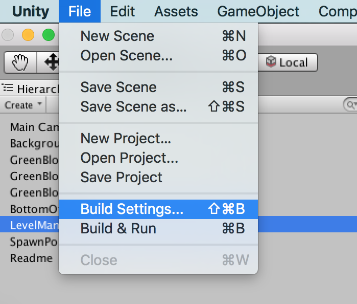
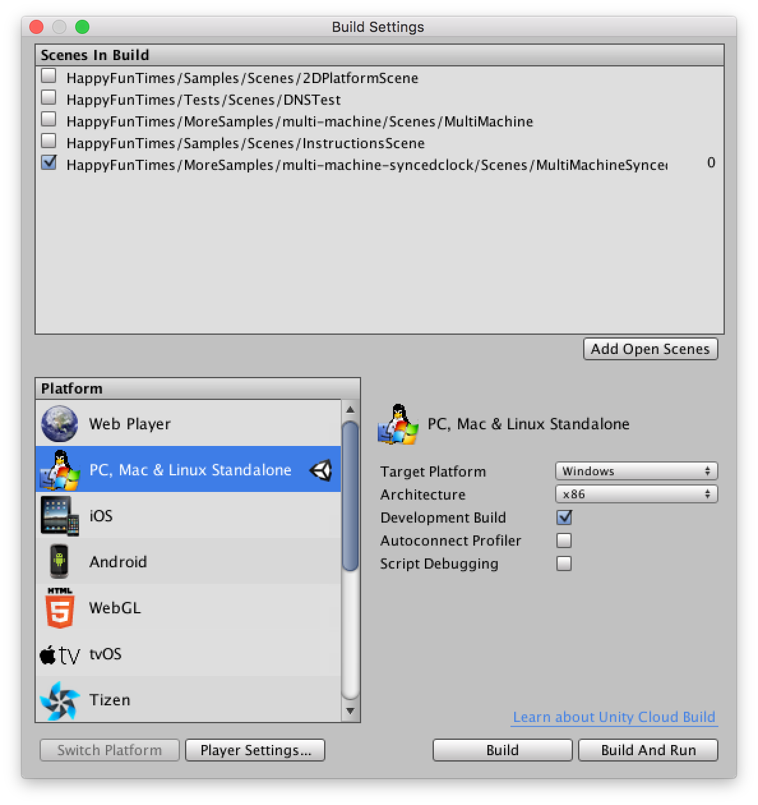

Title: Communicating Between Games
Description: How to send messages between games

First off if you haven't already you should read about [multi-machine games](multi-machine.md).
Those are games that run across multiple computers.

Sometimes through you aren't running game. You just want to syncronize data
between computers.

For example this runs on 8 computers. The only thing sychronized are some of the settings
and the clock.

<iframe width="853" height="480" src="https://www.youtube.com/embed/64TcBiqmVko?rel=0" frameborder="0" allowfullscreen></iframe>

To see a simple example open the `Assets/HappyFunTimes/MoreSamples/multi-machine-syncedclock/Scenes/MultiMachineSyncedClock`

You can run this sample solo in the Unity Editor but to run multiple copies it
**MUST BE RUN FROM THE COMMAND LINE**. The reason is each needs be told which
portion of the larger display to render.

Pick `File->Build Settings...` from the menus



Make sure the MultiMachineSyncedClock scene is the only scene selected.
If it doesn't appear click the `Add Open Scenes` button to add it.



Now click `Build` at the bottom. Save it as `test.app` if you're on OSX or `test.exe` if you're
on Windows.

Then on OSX open the Terminal, cd to the older you exported the game to, then type or copy
and paste each of these lines. You will need to get Unity to run the game in a window.

**Note: It's important to put the `&` at the end of each line**

```
test.app/Contents/MacOS/test --mm-full-width=1680 --mm-full-height=1050 --mm-x=0 --mm-y=0 --mm-width=400 --mm-height=300 &
test.app/Contents/MacOS/test --mm-full-width=1680 --mm-full-height=1050 --mm-x=400 --mm-y=0 --mm-width=400 --mm-height=300 --hft-url=ws://localhost:18679 &
test.app/Contents/MacOS/test --mm-full-width=1680 --mm-full-height=1050 --mm-x=800 --mm-y=0 --mm-width=400 --mm-height=300 --hft-url=ws://localhost:18679 &
```

If you're on Windows open a command prompt and type these commands

```
start /B test.exe --mm-full-width=1680 --mm-full-height=1050 --mm-x=0 --mm-y=0 --mm-width=400 --mm-height=300 &
start /B test.exe --mm-full-width=1680 --mm-full-height=1050 --mm-x=400 --mm-y=0 --mm-width=400 --mm-height=300 --hft-url=ws://localhost:18679 &
start /B test.exe --mm-full-width=1680 --mm-full-height=1050 --mm-x=800 --mm-y=0 --mm-width=400 --mm-height=300 --hft-url=ws://localhost:18679 &
```

If you arrange the windows left to right in the order you started them you should
see them all synchronized like this.


You can set the field of view on any one of them and it will set them on all.

If you actually have 3 separate machines to run on and they are all on the same network
run the game once on each machine except look up the IP address of the first machine
and change `localhost` to that ipaddress. For example my ip address is `192.168.2.9` so
I'd use `--hft-url=ws://192.168.2.9:18679`

## Sending Messages between Games

Sending and receiving messages from other games is very similar to sending and receiving messages
to and from phones except instead of using `NetPlayer` you use `GameServer`.

You can access the `GameServer` for your game through the `PlayerSpawner.GameServer`,
 `PlayerConnector.GameServer`, or `HFTNoPlayers.GameServer` property.

If you open `Assets/HappyFunTimes/MoreSamples/multi-machine-syncedclock/Scripts/ExampleSetCameraAcrossMachines.cs`
you can see we get the `HFTNoPlayers` component and from that the `GameServer`

    void Start()
    {
        HFTNoPlayers noPlayers = GetComponent<HFTNoPlayers>();
        m_gameServer = noPlayers.GameServer;
    }

    GameServer m_gameServer;

To send a message to a game you call `GameServer.SendCmdToGame(gameId, cmd, data)`
where `gameId` is the id of the game you want to send the message to. `cmd` is
a string specifying a command you make up and `data` is the any data you want to
send just like you do with when talking to controllers.

    class FovMsg {
        public FovMsg() {}  // for deserailization
        public FovMsg(float fov)
        {
            this.fov = fov;
        }
        public float fov;
    }

    // send an FOV message to game "gameABC"
    m_gameServer.SendCmdToGame("gameABC", "fov", new FovMsg(12));

To receive the messages you add handlers to the `GameServer`

    void Start() {
        HFTNoPlayers noPlayers = GetComponent<HFTNoPlayers>();
        m_gameServer = noPlayers.GameServer;

        m_gameServer.RegisterCmdHandler<FovMsg>("fov", HandleFovChange);
    }

    void HandleFovChange(FovMsg data, string otherGameId)
    {
        Debug.Log(otherGameId + " send us an fov of " + data.fov);
    }

You can also broadcast to all games by calling `GameServer.BroadcastCmdToGames`.

    m_gameServer.BroadcastCmdToGames("fov", new FovMsg(m_options.fieldOfView));

Even your own game will receive the message.

In our example we have code like this to put up the fov slider

    void OnGUI()
    {
        float oldFieldOfView = m_options.fieldOfView;
        GUILayout.BeginArea (new Rect (15, 15, 200, 60));
        GUILayout.BeginVertical();
        GUILayout.Box("fov: " + Mathf.Round(m_options.fieldOfView));
        m_options.fieldOfView = GUILayout.HorizontalSlider (m_options.fieldOfView, 10.0f, 170.0f);
        GUILayout.EndVertical();
        GUILayout.EndArea();

        // Only send if it changed
        if (oldFieldOfView != m_options.fieldOfView)
        {
            // broadcast the new fov to all games
            m_gameServer.BroadcastCmdToGames("fov", new FovMsg(m_options.fieldOfView));
        }
    }

NOTICE we don't set the camera's fov here. We just broadcast the message.
We'll get that message back ourselves.

Our `"fov'` message handler looks like this

    void HandleFovChange(FovMsg data, string otherGameId)
    {
        // If we're currently dragging the slider
        // we don't want to muck with it's value
        if (otherGameId != m_gameServer.Id)
        {
            m_options.fieldOfView = data.fov;
        }

        UpdateCamera();
    }

Because of the way Unity's IMGUI works we don't want to set `m_options.fieldOfView`
if we're the ones the sent the message. We do want to update the camera though
with the settings.

Look though the rest of the code and you'll find stuff about parsing arguments
so that each game knows which part of a large virtual display to render.

## Synced Clocks

The way this example works is that there are a grid of cubes all rotating
around a parent. That parent's rotation is set directly from a clock that
happyfuntimes keeps synchronized across machines.

Look in `Assets/HappyFunTimes/MoreSamples/multi-machine-syncedclock/Scripts/ExampleRotateBySyncClock.cs`

    public float speed = 1.0f;

    void Update ()
    {
        double time = HFTSyncedClock.Now;
        float rotation = (float)(time * (double)speed % 360.0);
        transform.eulerAngles = new Vector3(0.0f, rotation, 0.0f);
    }

And you'll see it's pretty straight forward. All we do is set the rotation to the clock.
Because the clock is synchronized every game will display the cubes rotated at the same places
at the same time.

We could use the clock to move characters on paths or do more complicated calculation but as
long as they are based on `HFTSyncedClock.Now` they'll match across machines.

The synchronized clock is also available for phones. See the example in
`Assets/HappyFunTimes/MoreSamples/synchedclock/Scenes/SyncedClockScene`
