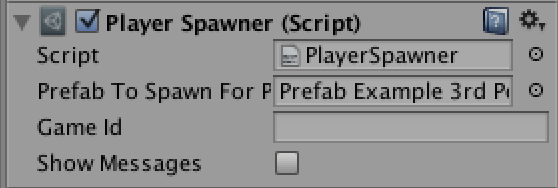
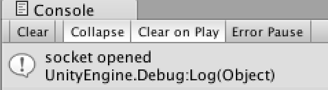
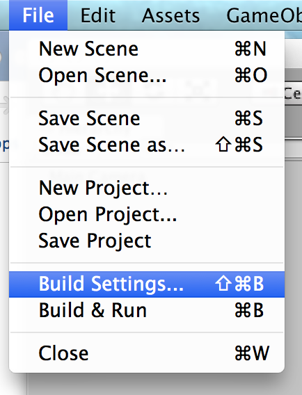
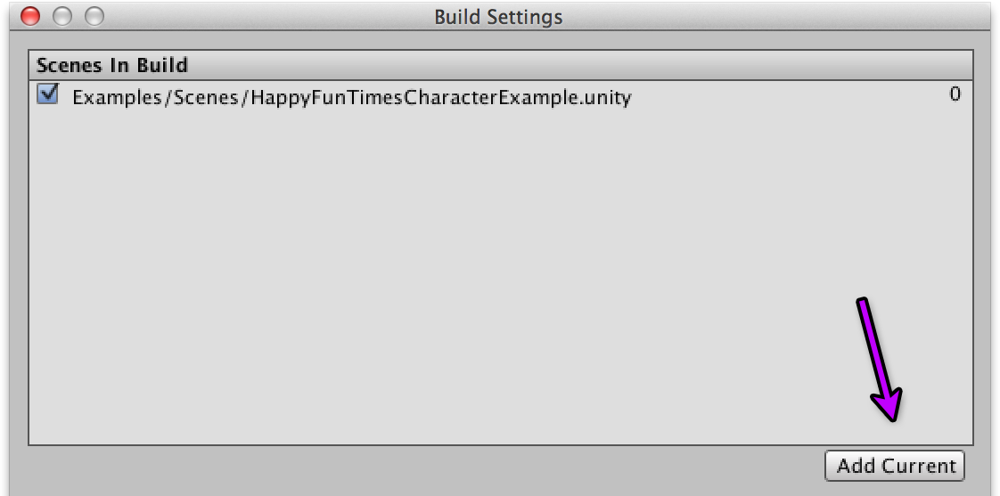
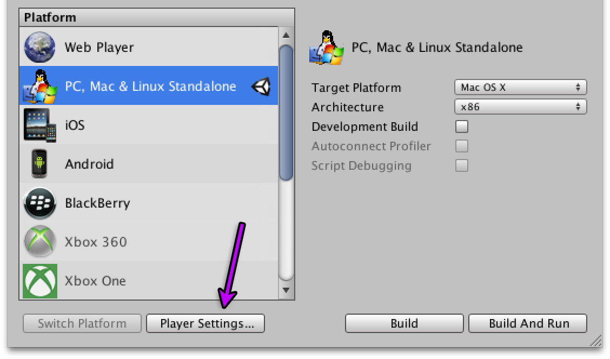
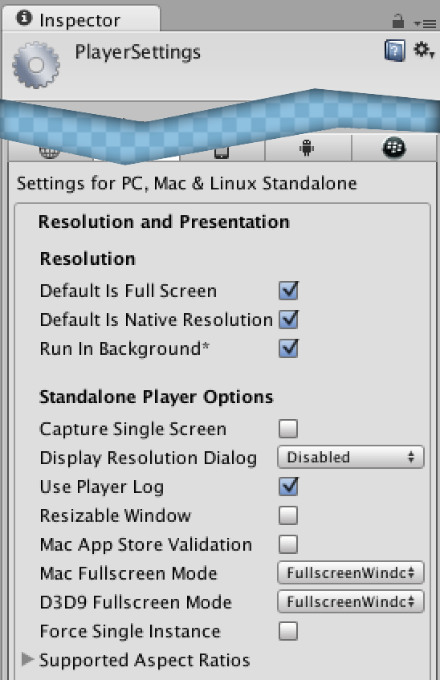

Unity Docs for HappyFunTimes
============================

### Table of Contents

*   **[Unity by cloning an existing project](#unity-by-cloning-an-existing-project)**
*   **[Unity from Scratch](#unity-from-scratch)**
*   **[Making the Game](#making-the-game)**
    *   **[Spawning Player GameObjects](#spawning-player-gameobjects)**
    *   **[Getting Input From Phones](#getting-input-from-phones)**
    *   **[Sending messages to the Phone](#sending-messages-to-the-phone)**
*   **[Publishing](#publishing)**
    *   **[Testing](#testing)**
    *   **[Publish](#publish)**
*   **[Ideas](ideas.md)**
*   **[Future Features](future.md)**

### Unity by cloning an existing project

Follow the instructions in [Making Games with HappyFunTimes](makinggames.md#setting-up-for-development) and
when cloning a game choose either

*   [Unitychararacterexample](http://github.com/greggman/hft-unitycharacterexample) A Unity3D example that spawns characters written in UnityScript.

*   [Unitysimple](http://github.com/greggman/hft-unitysimple) A Unity3D example that just positions a sphere for each player written in C#.

*   [Unity2dplatformer](http://github.com/greggman/hft-unity2dplatformer) A Unity3D example that shows a 2d platformer written in C#

*   [Unity-multi-game--example](http://github.com/greggman/hft-unity-multi-game-example) A Unity3D example that shows a 2d platformer written in C# that can span multiple computers (Advanced!)

### Unity from Scratch

*   TBD

## Making the game

These steps have already been done in the samples but assuming you were starting from
scratch these are the steps you'd have taken. Reading this will hopefully help you
understand the code.

### Spawning Player GameObjects

The easist way to start is to make a prefab that contains the GameObject that you
want to spawn everytime a player connects to the game. In that GameObject add a
new script. Let's say it's `MyPlayer.cs` or `MyPlayer.js`

In that script make a function called `InitializeNetPlayer`. This function will be
called when the prefab is spawned everytime a new player connects.

C# minimal code

    using UnityEngine;
    using HappyFunTimes;

    class MyPlayer : MonoBehaviour
    {
        private NetPlayer m_netPlayer;

        void InitializeNetPlayer(SpawnInfo spawnInfo) {
            m_netPlayer = spawnInfo.netPlayer;
            m_netPlayer.OnDisconnect += Remove;
        }

        // delete this gameobject if the player disconnects
        private void Remove(object sender, EventArgs e) {
            Destroy(gameObject);
        }

        ...
    }

UnityScript minimal code

    private var _netPlayer : HappyFunTimes.NetPlayer;

    function InitializeNetPlayer(spawnInfo : HappyFunTimes.SpawnInfo) {
        _netPlayer = spawnInfo.netPlayer;
        _netPlayer.OnDisconnect += Remove;
    }

    // delete this gameobject if the player disconnects
    function Remove() {
        Destroy(gameObject);
    }

Now make a new GameObject and add a Script Component, HappyFunTimes->PlayerSpawner.
In the properties for the PlayerSpawner set the `prefab to spawn for player` to the
prefab you just created. Leave `gameId` blank!

    

If happyfuntimes is running, and you followed all the other instructions about editing
`package.json` and running `hft add` etc, then if you run the game you should see the
message

    

If you open a browser window and go to `http://localhost:18679` you should see your
prefab get spawned. Open more browser windows/tabs you'll see more get spawned. Close them
and they'll disappear. NOTE: Since we didn't set a positon they'll all be in the exact
same spot.

### Getting Input from Phones

To get input from phones you need to program both the phone AND Unity. The
phones must currently be programmed in JavaScript since the entire point
is that there's nothing to install on the phone.  Maybe with Unity5 we'll
be able to make controllers in Unity as well but for now you've got to
code them.

The way HappyFunTimes work is you write JavaScript on the phone to get input
and send messages. For example here is some code in JavaScript to send a message

    client.sendCmd('move', {
      x: position.x / target.clientWidth,
      y: position.y / target.clientHeight,
    });

As you can see the command is called `move`. You make up that name. You decide
what data to send. In this case we're sending `x` and `y` and they are both
numbers, in case floating point numbers. in Unity we need to create
structs/classes that match, associate them with a command name, and register
a function to be called when the message arrives

C#

    [CmdName("move")]
    private class MessageMove : MessageCmdData {
        public float x = 0;
        public float y = 0;
    };

    void InitializeNetPlayer(SpawnInfo spawnInfo) {
        m_netPlayer = spawnInfo.netPlayer;
        ...
        m_netPlayer.RegisterCmdHandler<MessageMove>(OnMove);
    }

    private void OnMove(MessageMove data) {
        // Do something with data.x and data.y
        ...
    }

UnityScript

    @HappyFunTimes.CmdName("setColor")
    class MessageMove extends HappyFunTimes.MessageCmdData {
        var x : float;
        var y : float;
    };

    function InitializeNetPlayer(spawnInfo : HappyFunTimes.SpawnInfo) {
        _netPlayer = spawnInfo.netPlayer;
        ...
        _netPlayer.RegisterCmdHandler(OnMove);
    }

    function OnMove(data : MessageMove) {
        // Do something with data.x and data.y
        ...
    }

Hopefully that's clear.

### Sending messages to the Phone

To send a message to the phone define a class/struct and then call `NetPlayer.SendCmd`

C#

    [CmdName("scored")]
    private class MessageScored : MessageCmdData {
        public MessageScored(int _points) {
            points = _points;
        }

        public int points;
    }

    ... in some function ...

        m_netPlayer.SendCmd(new MessageScored(250));

UnityScript

    @HappyFunTimes.CmdName("scored")
    class MessageScored extends HappyFunTimes.MessageCmdData {
        var points : int;
    };

    ... in some function ...

        var data = new MessageScored();
        data.points = 250
        _netPlayer.SendCmd(data);

Then back in `controller.js` you can listen for that command with

        g_client.addEventListener('scored', handleScore);

        function handleScore(data) {
           // do something with data.points
        }

## Publishing

Once your game is ready to be published follow these steps

### Testing

First make sure your game works outside if the unity editor
so.

1.  Inside the Unity editor pick "File->Build Settings..."

    

2.  Click "Add Current" to add the current scene to "Scenes in Build".

    

3.  Click "Player Settings" at the bottom of the "Build Settings"

    

4.  Make sure the following are set

    *   Default is FullScreen (checked)
    *   Run in Background (checked)
    *   Display Resolution Dialog (disabled)

    

5.  Save the Scene and **Exit Unity**

6.  from the game folder run `hft export`

        cd myAwesomeGame
        hft export

7.  Now run happyfuntimes with `--app-mode` or
    in the browser go to `http://localhost:18679/games.html`
    and click on your game. It should launch and
    run as a stand alone app.

### Publish

from the game folder type

    hft publish

It will export again (just in case you forgot) and
then upload it all to a github release and finally
notify superhappyfuntimes.net to take a look.

Note: The first time you publish a **PERMANENT** association
is made for the game's gameId from the `package.json` to the
github repo being used in the game's folder. After that you
can publish newer versions of the game but they must be from
the same repo.

